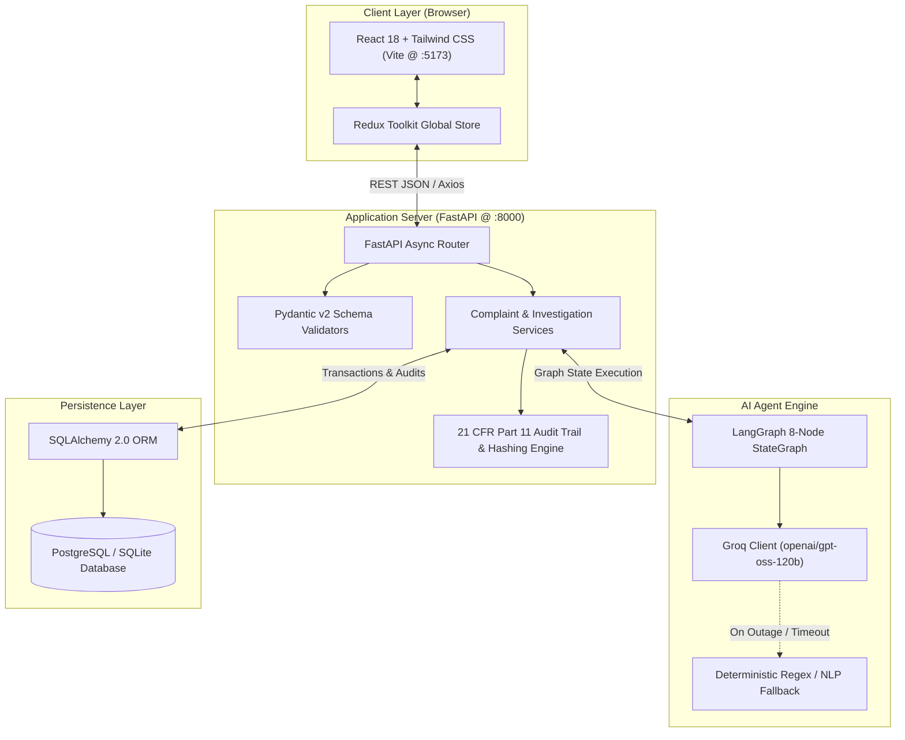
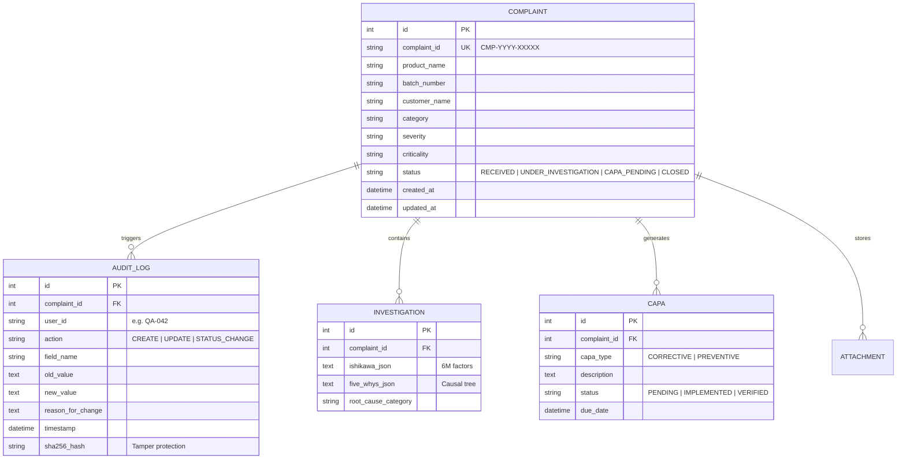

# PharmaGuard QMS — System Architecture & Technical Design

**System:** AI-Powered Customer Complaint Management System for Pharmaceutical Manufacturing  
**Regulatory Context:** US FDA 21 CFR 211.198 | 21 CFR Part 11 | ICH Q9 / Q10 | EU GMP Chapter 8 & Annex 11  
**Architecture Paradigm:** Decoupled Micro-Layered Web Client + Asynchronous REST API + Deterministic LangGraph Agent State Machine  

---

## 1. High-Level Architecture Overview

The application is structured into four clearly decoupled tiers:
1. **Presentation Tier (React 18 + Redux Toolkit):** Responsive, desktop-first pharmaceutical QMS user interface styled with Tailwind CSS and Google Inter typography.
2. **API & Business Logic Tier (Python 3.14 + FastAPI):** High-throughput asynchronous routing layer performing input validation, file parsing, business rule execution, and transactional lifecycle control.
3. **AI Intelligence Tier (LangGraph + Groq Cloud):** 8-node cyclical state machine orchestrating entity extraction, ICH Q9 risk assessment, 6M root cause analysis, and SMART CAPA synthesis using Groq's high-throughput `openai/gpt-oss-120b` engine.
4. **Data Persistence Tier (SQLAlchemy 2.0 + PostgreSQL / SQLite):** Relational schema enforcing referential integrity, immutable 21 CFR Part 11 audit trails, and SHA-256 cryptographic verification.



---

## 2. Frontend Architecture (React 18 + Redux Toolkit)

### Component Hierarchy & Design
The frontend lives in `frontend/src/` and adheres to a feature-driven, modular component layout:
```
frontend/src/
├── components/
│   ├── layout/          # Navbar, Sidebar, PageContainer, Header
│   ├── feedback/        # StatusBadge, ConfidenceBadge, CompletenessGauge, Toast
│   ├── forms/           # FormInput, FormSelect, FormTextarea, ProvenanceChip
│   ├── investigation/   # IshikawaDiagram (6M), FiveWhysTree, CAPATracker
│   └── audit/           # AuditTrailTimeline, SignatureModal
├── features/            # Redux slices:
│   ├── complaintsSlice.js   # Complaint records, filters, metrics, CRUD
│   ├── aiCopilotSlice.js    # Ingestion state, triage assessments, provenance
│   └── uiSlice.js           # Modal visibility, notifications, sidebar toggles
├── layouts/             # RootLayout with persistent Navbar & Sidebar
├── pages/               # DashboardPage, IntakePage, FormPage, ComplaintsPage, DetailPage, SettingsPage
├── services/            # Axios API client (api.js) with interceptors and timeout control
├── store/               # Redux configureStore setup
└── utils/               # Formatting, date helpers, ICH risk converters
```

### State Management Lifecycle (Redux Toolkit)
- **Single Source of Truth:** All cross-cutting state (active complaint list, selected triage recommendation, operator profile, KPI metrics) resides in the Redux store.
- **Async Flow via `createAsyncThunk`:** HTTP requests trigger dispatched thunks (`fetchComplaints`, `analyzeComplaintNarrative`, `saveComplaintRecord`). Components react to normalized `status: 'idle' | 'loading' | 'succeeded' | 'failed'` flags.
- **Field Provenance Tracking:** When AI populates a draft form, each field is assigned an origin tag (`EXTRACTED` or `AI_COPILOT`). When an operator modifies an input, a Redux reducer dynamically switches the tag to `EDITED`, ensuring visual clarity before submission.

---

## 3. Backend Architecture (FastAPI + Pydantic v2)

### Structure & Clean Architecture
```
backend/app/
├── api/                 # Endpoint routers:
│   ├── complaints.py    # CRUD, status advance, metrics, investigations
│   ├── ai.py            # AI triage, risk assessment, completeness, CAPA
│   ├── uploads.py       # File ingestion with SHA-256 and text parsing
│   └── health.py        # System health and AI engine diagnostics
├── core/                # Core configuration & logging
├── services/            # Business logic: complaint_service.py, audit_service.py
├── schemas/             # Pydantic v2 schemas: StructuredAIAnalysisSchema, ComplaintCreateSchema
├── models/              # SQLAlchemy models: Complaint, AuditLog, Investigation, CAPA
├── ai/                  # LangGraph state machine: graph.py, nodes.py, llm.py
├── config.py            # Pydantic BaseSettings loading backend/.env
└── database.py          # Dual-driver SQLAlchemy session factory
```

### Request Lifecycle
1. **HTTP Ingestion:** FastAPI receives client request over HTTP (e.g. `POST /api/ai/analyze-complaint`).
2. **Schema Ingress Validation:** Pydantic models validate data structures, data types, and required payload fields at the network boundary.
3. **Service Layer Execution:** The controller delegates execution to `complaint_service` or `ai_service`.
4. **Agent Execution / Transaction:** Logic either invokes the LangGraph state machine or interacts with the SQLAlchemy database session.
5. **Egress Validation & Audit Emission:** Outgoing responses are validated against Pydantic response models, while mutating operations write to the append-only `audit_logs` table.

---

## 4. AI Agent Architecture (LangGraph + Groq)

### StateGraph Definition
The AI triage pipeline is modeled as an 8-node directed cyclical graph in `backend/app/ai/nodes.py` using `langgraph.graph.StateGraph`:

```mermaid
flowchart LR
    Start([Input Narrative]) --> Node1["1. normalize_input"]
    Node1 --> Node2["2. extract_complaint"]
    Node2 --> Node3["3. completeness_check"]
    Node3 --> Node4["4. risk_assessment"]
    Node4 --> Node5["5. duplicate_detection"]
    Node5 --> Node6["6. root_cause_recommendation"]
    Node6 --> Node7["7. capa_recommendation"]
    Node7 --> Node8["8. final_response"]
    Node8 --> Finish([16-Key Validated JSON])
```



### Node Functional Responsibilities

| Node Index | Node Function Name | Responsibility & Pharmaceutical Output |
| :-: | :--- | :--- |
| **1** | `normalize_input` | Strips unwanted control characters, normalizes whitespace, sanitizes PII, and flags input channel. |
| **2** | `extract_complaint` | Parses drug trade name, active dosage, batch/lot number, complainant facility, and defect description. |
| **3** | `completeness_check` | Audits extracted attributes against FDA 21 CFR 211.198 criteria; calculates completeness % and follow-up prompts. |
| **4** | `risk_assessment` | Evaluates defect severity, patient harm probability, and assigns ICH Q9 Criticality (Class I/II/III). |
| **5** | `duplicate_detection` | Queries database for identical batch numbers, active APIs, or recurring defect patterns. |
| **6** | `root_cause_recommendation` | Maps defect factors against 6M Ishikawa dimensions (Machine, Material, Method, Manpower, Milieu, Measurement). |
| **7** | `capa_recommendation` | Drafts immediate quarantine containment, corrective engineering repairs, and preventive SOP updates. |
| **8** | `final_response` | Assembles the validated dictionary containing all 16 required keys and attaches telemetry metadata. |

---

## 5. Database Architecture & 21 CFR Part 11 Audit Model

### Relational Schema Design


### 21 CFR Part 11 Compliance Enforcement
1. **Append-Only Immutability:** Audit log rows cannot be updated or deleted through the API or ORM models.
2. **Mandatory Reason for Change:** Any update to an existing record requires a non-empty `reason_for_change` string.
3. **Cryptographic SHA-256 Hashing:** Each audit event hashes `user_id + action + field_name + old_value + new_value + timestamp`, providing tamper-evident verification.

---

## 6. Security Model & Key Protection

1. **Zero Secret Exposure:** `GROQ_API_KEY` is loaded strictly on the backend via Pydantic `BaseSettings` reading from `backend/.env`.
2. **Frontend Isolation:** The React frontend makes REST calls exclusively to `http://127.0.0.1:8000`. No API keys or LLM provider tokens exist in the client bundle.
3. **Repository Hygiene:** Comprehensive `.gitignore` rules prevent `.env`, `.env.*`, `node_modules/`, `dist/`, `*.db`, and `__pycache__/` from being staged or committed.

---

## 7. Resilience & Failure Handling

| Failure Mode | System Response & Mitigation |
| :--- | :--- |
| **Groq API Rate Limit (429) / Outage (503)** | Async HTTP client catches connection errors and automatically switches to the deterministic local rule-based NLP engine. |
| **LLM Schema Malformation** | Groq `response_format={"type": "json_object"}` constrains output syntax, followed by Pydantic validator regex cleanups and schema defaults. |
| **Database Disconnection** | SQLAlchemy connection pooling configured with `pool_pre_ping=True` automatically detects stale sockets and reconnects. |
| **Missing Batch or Product Data** | The `completeness_check` node flags missing statutory fields and populates `missing_information` follow-up questions for the operator. |
