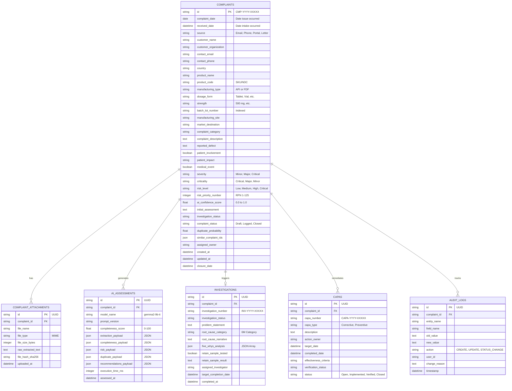

# Phase 1: Complaint Data Model Specification
## AI-Powered Customer Complaint Management System for Pharmaceutical Manufacturing

---

## 1. Architectural Principles & Portability Strategy

The data architecture for the Pharmaceutical Complaint Management System is designed to satisfy three foundational criteria:
1. **Regulatory Compliance (21 CFR Part 11 & EU GMP Annex 11):** Immutability of historical audits, explicit versioning of AI assessments, and traceability of all field-level updates.
2. **Database Engine Portability:** Primary target is **PostgreSQL**, but designed so **MySQL (8.0+)** and **SQLite** (for local development/testing) are supported without schema restructuring. This is accomplished by using standard SQLAlchemy 2.0 types (`String`, `Text`, `Integer`, `Float`, `Boolean`, `DateTime`, and standard `JSON` abstractions rather than PostgreSQL-exclusive native extensions).
3. **Domain Rigor:** Strict normalization separating core complaint tracking, raw intake documents, AI assessment telemetry, root-cause investigations, CAPA action plans, and audit events.

---

## 2. Entity-Relationship (ER) Diagram



---

## 3. Detailed Data Dictionary & Rationale

### 3.1 Primary Table: `complaints`

| Column Name | SQL Type | Nullable | Default | Description & Regulatory Rationale |
| :--- | :--- | :--- | :--- | :--- |
| `id` | `VARCHAR(32)` | NO | PRIMARY KEY | Unique regulatory complaint tracking number (e.g. `CMP-2026-00104`). Human-readable and sequential per FDA complaint filing mandates. |
| `complaint_date` | `DATE` | YES | NULL | The date the defect was observed by the customer or patient. |
| `received_date` | `TIMESTAMP` | NO | `CURRENT_TIMESTAMP` | The exact timestamp the manufacturer received the complaint. Regulatory clock (e.g. 15-day alert) starts here. |
| `source` | `VARCHAR(32)` | NO | `'Email'` | Intake channel: `Email`, `Phone`, `Web Portal`, `Written Letter`, `Regulatory Notification`. |
| `customer_name` | `VARCHAR(128)` | YES | NULL | Full name of the complainant or reporting healthcare professional. |
| `customer_organization` | `VARCHAR(128)` | YES | NULL | Hospital, pharmacy chain, distributor, or clinic name. |
| `contact_email` | `VARCHAR(128)` | YES | NULL | Complainant email address for follow-up communications. |
| `contact_phone` | `VARCHAR(64)` | YES | NULL | Complainant phone number. |
| `country` | `VARCHAR(64)` | NO | `'USA'` | Geographic market of distribution; determines competent authority reporting (FDA, EMA, MHRA, CDSCO). |
| `product_name` | `VARCHAR(128)` | NO | None | Commercial trade name of drug product or bulk chemical substance. |
| `product_code` | `VARCHAR(64)` | YES | NULL | Internal SKU, NDC (National Drug Code), or SAP material ID. |
| `manufacturing_type` | `VARCHAR(16)` | NO | `'FDF'` | Distinguishes whether the item is `API` (Active Pharmaceutical Ingredient) or `FDF` (Finished Dosage Form). |
| `dosage_form` | `VARCHAR(64)` | YES | NULL | E.g., `Tablet`, `Capsule`, `Sterile Lyophilized Vial`, `Oral Suspension`, `Bulk Crystalline Powder`. |
| `strength` | `VARCHAR(64)` | YES | NULL | Dosage strength/potency (e.g., `500 mg`, `10 mg/mL`, `99.8% Assay`). |
| `batch_lot_number` | `VARCHAR(64)` | NO | None | **Critical Regulatory Identifier.** Indexed for rapid batch tracking and historical duplicate correlation. |
| `manufacturing_site` | `VARCHAR(128)` | YES | NULL | Facility where the batch was produced (e.g. Site A - Formulation, Site B - Packaging). |
| `market_destination` | `VARCHAR(64)` | YES | NULL | Intended destination jurisdiction (e.g. US Domestic, EU, Latin America). |
| `complaint_category` | `VARCHAR(64)` | NO | `'Physical Defect'` | Standard classification: `Packaging`, `Physical Defect`, `Chemical/Assay`, `Microbial`, `Labeling`, `Clinical/Adverse Event`, `Counterfeit Suspect`. |
| `complaint_description`| `TEXT` | NO | None | Complete verbatim statement or sanitized customer narrative of the incident. |
| `reported_defect` | `TEXT` | NO | None | Normalized technical summary of the defect (e.g. "Blister seal micro-channeling with softened discolored tablets"). |
| `patient_involvement` | `BOOLEAN` | NO | `FALSE` | Flag indicating whether the drug was administered to or in possession of an end-user patient. |
| `patient_impact` | `VARCHAR(64)` | NO | `'None'` | Clinical outcome classification: `None`, `Minor Symptoms`, `Severe Illness`, `Life-Threatening / Hospitalization`, `Fatal`. |
| `medical_event` | `BOOLEAN` | NO | `FALSE` | Indicates whether the event constitutes an adverse drug experience (ADE) under pharmacovigilance regulations. |
| `severity` | `VARCHAR(32)` | NO | `'Minor'` | Technical severity: `Minor`, `Major`, `Critical`. |
| `criticality` | `VARCHAR(32)` | NO | `'Minor'` | Regulatory defect criticality (Class I, Class II, Class III recall equivalents). |
| `risk_level` | `VARCHAR(32)` | NO | `'Low'` | Overall Quality Risk Tier: `Low`, `Medium`, `High`, `Critical`. |
| `risk_priority_number` | `INTEGER` | YES | 1 | Calculated RPN score ($S \times O \times D$), range 1 to 125. |
| `ai_confidence_score` | `FLOAT` | NO | 1.0 | Aggregate extraction and evaluation confidence (0.00 to 1.00). |
| `initial_assessment` | `TEXT` | YES | NULL | AI-generated preliminary evaluation and risk rationale. |
| `investigation_status` | `VARCHAR(32)` | NO | `'Not Initiated'` | `Not Initiated`, `Under Investigation`, `Lab Testing`, `Completed`, `Waived`. |
| `complaint_status` | `VARCHAR(32)` | NO | `'Logged'` | Lifecycle state: `Draft`, `Logged`, `Under Review`, `Under Investigation`, `CAPA Pending`, `Closure Review`, `Closed`, `Reopened`. |
| `duplicate_probability` | `FLOAT` | YES | 0.0 | Similarity score against historical complaints (0.00 to 1.00). |
| `similar_complaint_ids` | `JSON` | YES | `'[]'` | JSON array of correlated complaint IDs (e.g. `["CMP-2026-00088", "CMP-2026-00092"]`). |
| `assigned_owner` | `VARCHAR(64)` | YES | NULL | QA personnel or investigator assigned to resolve the complaint. |
| `created_at` | `TIMESTAMP` | NO | `CURRENT_TIMESTAMP` | System creation time. |
| `updated_at` | `TIMESTAMP` | NO | `CURRENT_TIMESTAMP` | Last updated timestamp. |
| `closure_date` | `TIMESTAMP` | YES | NULL | Official sign-off and closure timestamp by Quality Unit. |

---

### 3.2 Supplementary Tables

#### `complaint_attachments`
Stores references to raw inputs, customer emails, scanned inspection PDFs, and photos.
- `id` (UUID, PK)
- `complaint_id` (FK -> `complaints.id`)
- `file_name` (VARCHAR)
- `file_type` (VARCHAR - MIME type)
- `file_size_bytes` (INTEGER)
- `raw_extracted_text` (TEXT - OCR or parsed body text)
- `file_hash_sha256` (VARCHAR - cryptographic digest for tamper-evidence)
- `uploaded_at` (TIMESTAMP)

#### `ai_assessments`
Maintains a full, immutable audit record of every AI execution. Required for 21 CFR Part 11 validation of AI algorithms.
- `id` (UUID, PK)
- `complaint_id` (FK -> `complaints.id`)
- `model_name` (VARCHAR - e.g. `gemma2-9b-it`, `llama-3.3-70b-versatile`)
- `prompt_version` (VARCHAR - e.g. `v1.2-langgraph`)
- `completeness_score` (FLOAT - 0 to 100)
- `extraction_payload` (JSON - raw extracted entities)
- `completeness_payload` (JSON - missing fields and follow-up questions)
- `risk_payload` (JSON - RPN components, clinical risk rationale)
- `duplicate_payload` (JSON - matched complaints and similarity rationale)
- `recommendations_payload` (JSON - 6M root cause & CAPA suggestions)
- `execution_time_ms` (INTEGER - inference latency)
- `assessed_at` (TIMESTAMP)

#### `investigations`
Formal investigation record linking complaints to manufacturing root cause analysis.
- `id` (UUID, PK)
- `complaint_id` (FK -> `complaints.id`, UNIQUE)
- `investigation_number` (VARCHAR, e.g. `INV-2026-00045`)
- `investigation_status` (VARCHAR - `Open`, `In Progress`, `Completed`)
- `problem_statement` (TEXT - standardized 5W2H problem statement)
- `root_cause_category` (VARCHAR - `Man`, `Machine`, `Method`, `Material`, `Measurement`, `Environment`)
- `root_cause_narrative` (TEXT - technical explanation)
- `five_whys_analysis` (JSON - array of 5 causal interrogations)
- `retain_sample_tested` (BOOLEAN)
- `retain_sample_result` (TEXT)
- `assigned_investigator` (VARCHAR)
- `target_completion_date` (DATETIME)
- `completed_at` (DATETIME)

#### `capas`
Corrective and Preventive Actions created to prevent defect recurrence.
- `id` (UUID, PK)
- `complaint_id` (FK -> `complaints.id`)
- `capa_number` (VARCHAR, e.g. `CAPA-2026-00021`)
- `capa_type` (VARCHAR - `Corrective Action`, `Preventive Action`)
- `description` (TEXT - detailed task description)
- `action_owner` (VARCHAR - responsible engineer)
- `target_date` (DATETIME)
- `completed_date` (DATETIME)
- `effectiveness_criteria` (VARCHAR)
- `verification_status` (VARCHAR - `Pending`, `Effective`, `Ineffective`)
- `status` (VARCHAR - `Open`, `In Progress`, `Implemented`, `Closed`)

#### `audit_logs`
Automated, append-only ledger for all modifications (FDA 21 CFR Part 11 compliance).
- `id` (UUID, PK)
- `complaint_id` (FK -> `complaints.id`)
- `entity_name` (VARCHAR - e.g. `complaints`, `investigations`)
- `field_name` (VARCHAR - field that was modified)
- `old_value` (TEXT)
- `new_value` (TEXT)
- `action` (VARCHAR - `CREATE`, `UPDATE`, `STATUS_CHANGE`, `OVERRIDE`)
- `user_id` (VARCHAR - session or operator ID)
- `change_reason` (TEXT - mandatory rationale for any update)
- `timestamp` (TIMESTAMP, default `CURRENT_TIMESTAMP`)

---

## 4. SQL DDL Schema (PostgreSQL & MySQL Compatible)

```sql
-- =========================================================================
-- PHARMACEUTICAL QUALITY MANAGEMENT SYSTEM: COMPLAINT DATA SCHEMA
-- Dialect: ANSI SQL / PostgreSQL 15+ (100% compatible with MySQL 8.0+)
-- =========================================================================

CREATE TABLE IF NOT EXISTS complaints (
    id VARCHAR(32) PRIMARY KEY,
    complaint_date DATE NULL,
    received_date TIMESTAMP NOT NULL DEFAULT CURRENT_TIMESTAMP,
    source VARCHAR(32) NOT NULL DEFAULT 'Email',
    customer_name VARCHAR(128) NULL,
    customer_organization VARCHAR(128) NULL,
    contact_email VARCHAR(128) NULL,
    contact_phone VARCHAR(64) NULL,
    country VARCHAR(64) NOT NULL DEFAULT 'USA',
    product_name VARCHAR(128) NOT NULL,
    product_code VARCHAR(64) NULL,
    manufacturing_type VARCHAR(16) NOT NULL DEFAULT 'FDF',
    dosage_form VARCHAR(64) NULL,
    strength VARCHAR(64) NULL,
    batch_lot_number VARCHAR(64) NOT NULL,
    manufacturing_site VARCHAR(128) NULL,
    market_destination VARCHAR(64) NULL,
    complaint_category VARCHAR(64) NOT NULL DEFAULT 'Physical Defect',
    complaint_description TEXT NOT NULL,
    reported_defect TEXT NOT NULL,
    patient_involvement BOOLEAN NOT NULL DEFAULT FALSE,
    patient_impact VARCHAR(64) NOT NULL DEFAULT 'None',
    medical_event BOOLEAN NOT NULL DEFAULT FALSE,
    severity VARCHAR(32) NOT NULL DEFAULT 'Minor',
    criticality VARCHAR(32) NOT NULL DEFAULT 'Minor',
    risk_level VARCHAR(32) NOT NULL DEFAULT 'Low',
    risk_priority_number INTEGER NULL DEFAULT 1,
    ai_confidence_score REAL NOT NULL DEFAULT 1.0,
    initial_assessment TEXT NULL,
    investigation_status VARCHAR(32) NOT NULL DEFAULT 'Not Initiated',
    complaint_status VARCHAR(32) NOT NULL DEFAULT 'Logged',
    duplicate_probability REAL NULL DEFAULT 0.0,
    similar_complaint_ids JSON NULL,
    assigned_owner VARCHAR(64) NULL,
    created_at TIMESTAMP NOT NULL DEFAULT CURRENT_TIMESTAMP,
    updated_at TIMESTAMP NOT NULL DEFAULT CURRENT_TIMESTAMP,
    closure_date TIMESTAMP NULL
);

CREATE INDEX idx_complaints_batch ON complaints(batch_lot_number);
CREATE INDEX idx_complaints_status ON complaints(complaint_status);
CREATE INDEX idx_complaints_criticality ON complaints(criticality);
CREATE INDEX idx_complaints_product ON complaints(product_name);
CREATE INDEX idx_complaints_received_date ON complaints(received_date);

CREATE TABLE IF NOT EXISTS complaint_attachments (
    id VARCHAR(36) PRIMARY KEY,
    complaint_id VARCHAR(32) NOT NULL,
    file_name VARCHAR(255) NOT NULL,
    file_type VARCHAR(64) NOT NULL,
    file_size_bytes INTEGER NOT NULL,
    raw_extracted_text TEXT NULL,
    file_hash_sha256 VARCHAR(64) NULL,
    uploaded_at TIMESTAMP NOT NULL DEFAULT CURRENT_TIMESTAMP,
    CONSTRAINT fk_attachment_complaint FOREIGN KEY (complaint_id) REFERENCES complaints(id) ON DELETE CASCADE
);

CREATE INDEX idx_attachments_complaint ON complaint_attachments(complaint_id);

CREATE TABLE IF NOT EXISTS ai_assessments (
    id VARCHAR(36) PRIMARY KEY,
    complaint_id VARCHAR(32) NOT NULL,
    model_name VARCHAR(64) NOT NULL,
    prompt_version VARCHAR(32) NOT NULL,
    completeness_score REAL NOT NULL DEFAULT 0.0,
    extraction_payload JSON NULL,
    completeness_payload JSON NULL,
    risk_payload JSON NULL,
    duplicate_payload JSON NULL,
    recommendations_payload JSON NULL,
    execution_time_ms INTEGER NOT NULL DEFAULT 0,
    assessed_at TIMESTAMP NOT NULL DEFAULT CURRENT_TIMESTAMP,
    CONSTRAINT fk_assessment_complaint FOREIGN KEY (complaint_id) REFERENCES complaints(id) ON DELETE CASCADE
);

CREATE INDEX idx_assessments_complaint ON ai_assessments(complaint_id);

CREATE TABLE IF NOT EXISTS investigations (
    id VARCHAR(36) PRIMARY KEY,
    complaint_id VARCHAR(32) UNIQUE NOT NULL,
    investigation_number VARCHAR(32) NOT NULL,
    investigation_status VARCHAR(32) NOT NULL DEFAULT 'Open',
    problem_statement TEXT NULL,
    root_cause_category VARCHAR(64) NULL,
    root_cause_narrative TEXT NULL,
    five_whys_analysis JSON NULL,
    retain_sample_tested BOOLEAN NOT NULL DEFAULT FALSE,
    retain_sample_result TEXT NULL,
    assigned_investigator VARCHAR(64) NULL,
    target_completion_date TIMESTAMP NULL,
    completed_at TIMESTAMP NULL,
    CONSTRAINT fk_investigation_complaint FOREIGN KEY (complaint_id) REFERENCES complaints(id) ON DELETE CASCADE
);

CREATE TABLE IF NOT EXISTS capas (
    id VARCHAR(36) PRIMARY KEY,
    complaint_id VARCHAR(32) NOT NULL,
    capa_number VARCHAR(32) NOT NULL,
    capa_type VARCHAR(32) NOT NULL DEFAULT 'Corrective Action',
    description TEXT NOT NULL,
    action_owner VARCHAR(64) NULL,
    target_date TIMESTAMP NULL,
    completed_date TIMESTAMP NULL,
    effectiveness_criteria VARCHAR(255) NULL,
    verification_status VARCHAR(32) NOT NULL DEFAULT 'Pending',
    status VARCHAR(32) NOT NULL DEFAULT 'Open',
    CONSTRAINT fk_capa_complaint FOREIGN KEY (complaint_id) REFERENCES complaints(id) ON DELETE CASCADE
);

CREATE INDEX idx_capas_complaint ON capas(complaint_id);

CREATE TABLE IF NOT EXISTS audit_logs (
    id VARCHAR(36) PRIMARY KEY,
    complaint_id VARCHAR(32) NOT NULL,
    entity_name VARCHAR(64) NOT NULL DEFAULT 'complaints',
    field_name VARCHAR(64) NOT NULL,
    old_value TEXT NULL,
    new_value TEXT NULL,
    action VARCHAR(32) NOT NULL,
    user_id VARCHAR(64) NOT NULL,
    change_reason TEXT NOT NULL,
    timestamp TIMESTAMP NOT NULL DEFAULT CURRENT_TIMESTAMP,
    CONSTRAINT fk_audit_complaint FOREIGN KEY (complaint_id) REFERENCES complaints(id) ON DELETE CASCADE
);

CREATE INDEX idx_audit_complaint ON audit_logs(complaint_id);
CREATE INDEX idx_audit_timestamp ON audit_logs(timestamp);
```

---

## 5. SQLAlchemy Python Model Definitions

```python
"""
SQLAlchemy 2.0 ORM Models for Pharma Complaint Management System.
Compatible with PostgreSQL, MySQL 8.0, and SQLite.
"""

from datetime import datetime, date
from typing import Optional, List, Dict, Any
from sqlalchemy import (
    String, Text, Integer, Float, Boolean, Date, DateTime, JSON, ForeignKey, Index
)
from sqlalchemy.orm import DeclarativeBase, Mapped, mapped_column, relationship

class Base(DeclarativeBase):
    pass

class Complaint(Base):
    __tablename__ = "complaints"

    id: Mapped[str] = mapped_column(String(32), primary_key=True)
    complaint_date: Mapped[Optional[date]] = mapped_column(Date, nullable=True)
    received_date: Mapped[datetime] = mapped_column(DateTime, default=datetime.utcnow, nullable=False)
    source: Mapped[str] = mapped_column(String(32), default="Email", nullable=False)
    customer_name: Mapped[Optional[str]] = mapped_column(String(128), nullable=True)
    customer_organization: Mapped[Optional[str]] = mapped_column(String(128), nullable=True)
    contact_email: Mapped[Optional[str]] = mapped_column(String(128), nullable=True)
    contact_phone: Mapped[Optional[str]] = mapped_column(String(64), nullable=True)
    country: Mapped[str] = mapped_column(String(64), default="USA", nullable=False)
    
    product_name: Mapped[str] = mapped_column(String(128), nullable=False)
    product_code: Mapped[Optional[str]] = mapped_column(String(64), nullable=True)
    manufacturing_type: Mapped[str] = mapped_column(String(16), default="FDF", nullable=False)
    dosage_form: Mapped[Optional[str]] = mapped_column(String(64), nullable=True)
    strength: Mapped[Optional[str]] = mapped_column(String(64), nullable=True)
    batch_lot_number: Mapped[str] = mapped_column(String(64), nullable=False, index=True)
    manufacturing_site: Mapped[Optional[str]] = mapped_column(String(128), nullable=True)
    market_destination: Mapped[Optional[str]] = mapped_column(String(64), nullable=True)
    
    complaint_category: Mapped[str] = mapped_column(String(64), default="Physical Defect", nullable=False)
    complaint_description: Mapped[str] = mapped_column(Text, nullable=False)
    reported_defect: Mapped[str] = mapped_column(Text, nullable=False)
    patient_involvement: Mapped[bool] = mapped_column(Boolean, default=False, nullable=False)
    patient_impact: Mapped[str] = mapped_column(String(64), default="None", nullable=False)
    medical_event: Mapped[bool] = mapped_column(Boolean, default=False, nullable=False)
    
    severity: Mapped[str] = mapped_column(String(32), default="Minor", nullable=False)
    criticality: Mapped[str] = mapped_column(String(32), default="Minor", nullable=False, index=True)
    risk_level: Mapped[str] = mapped_column(String(32), default="Low", nullable=False)
    risk_priority_number: Mapped[Optional[int]] = mapped_column(Integer, default=1, nullable=True)
    ai_confidence_score: Mapped[float] = mapped_column(Float, default=1.0, nullable=False)
    initial_assessment: Mapped[Optional[str]] = mapped_column(Text, nullable=True)
    
    investigation_status: Mapped[str] = mapped_column(String(32), default="Not Initiated", nullable=False)
    complaint_status: Mapped[str] = mapped_column(String(32), default="Logged", nullable=False, index=True)
    duplicate_probability: Mapped[Optional[float]] = mapped_column(Float, default=0.0, nullable=True)
    similar_complaint_ids: Mapped[Optional[List[str]]] = mapped_column(JSON, default=list, nullable=True)
    assigned_owner: Mapped[Optional[str]] = mapped_column(String(64), nullable=True)
    
    created_at: Mapped[datetime] = mapped_column(DateTime, default=datetime.utcnow, nullable=False)
    updated_at: Mapped[datetime] = mapped_column(DateTime, default=datetime.utcnow, onupdate=datetime.utcnow, nullable=False)
    closure_date: Mapped[Optional[datetime]] = mapped_column(DateTime, nullable=True)

    # Relationships
    attachments: Mapped[List["ComplaintAttachment"]] = relationship("ComplaintAttachment", back_populates="complaint", cascade="all, delete-orphan")
    ai_assessments: Mapped[List["AIAssessment"]] = relationship("AIAssessment", back_populates="complaint", cascade="all, delete-orphan")
    investigation: Mapped[Optional["Investigation"]] = relationship("Investigation", back_populates="complaint", uselist=False, cascade="all, delete-orphan")
    capas: Mapped[List["CAPA"]] = relationship("CAPA", back_populates="complaint", cascade="all, delete-orphan")
    audit_logs: Mapped[List["AuditLog"]] = relationship("AuditLog", back_populates="complaint", cascade="all, delete-orphan")

class ComplaintAttachment(Base):
    __tablename__ = "complaint_attachments"

    id: Mapped[str] = mapped_column(String(36), primary_key=True)
    complaint_id: Mapped[str] = mapped_column(String(32), ForeignKey("complaints.id", ondelete="CASCADE"), nullable=False, index=True)
    file_name: Mapped[str] = mapped_column(String(255), nullable=False)
    file_type: Mapped[str] = mapped_column(String(64), nullable=False)
    file_size_bytes: Mapped[int] = mapped_column(Integer, nullable=False)
    raw_extracted_text: Mapped[Optional[str]] = mapped_column(Text, nullable=True)
    file_hash_sha256: Mapped[Optional[str]] = mapped_column(String(64), nullable=True)
    uploaded_at: Mapped[datetime] = mapped_column(DateTime, default=datetime.utcnow, nullable=False)

    complaint: Mapped["Complaint"] = relationship("Complaint", back_populates="attachments")

class AIAssessment(Base):
    __tablename__ = "ai_assessments"

    id: Mapped[str] = mapped_column(String(36), primary_key=True)
    complaint_id: Mapped[str] = mapped_column(String(32), ForeignKey("complaints.id", ondelete="CASCADE"), nullable=False, index=True)
    model_name: Mapped[str] = mapped_column(String(64), nullable=False)
    prompt_version: Mapped[str] = mapped_column(String(32), nullable=False)
    completeness_score: Mapped[float] = mapped_column(Float, default=0.0, nullable=False)
    extraction_payload: Mapped[Optional[Dict[str, Any]]] = mapped_column(JSON, nullable=True)
    completeness_payload: Mapped[Optional[Dict[str, Any]]] = mapped_column(JSON, nullable=True)
    risk_payload: Mapped[Optional[Dict[str, Any]]] = mapped_column(JSON, nullable=True)
    duplicate_payload: Mapped[Optional[Dict[str, Any]]] = mapped_column(JSON, nullable=True)
    recommendations_payload: Mapped[Optional[Dict[str, Any]]] = mapped_column(JSON, nullable=True)
    execution_time_ms: Mapped[int] = mapped_column(Integer, default=0, nullable=False)
    assessed_at: Mapped[datetime] = mapped_column(DateTime, default=datetime.utcnow, nullable=False)

    complaint: Mapped["Complaint"] = relationship("Complaint", back_populates="ai_assessments")

class Investigation(Base):
    __tablename__ = "investigations"

    id: Mapped[str] = mapped_column(String(36), primary_key=True)
    complaint_id: Mapped[str] = mapped_column(String(32), ForeignKey("complaints.id", ondelete="CASCADE"), unique=True, nullable=False)
    investigation_number: Mapped[str] = mapped_column(String(32), nullable=False)
    investigation_status: Mapped[str] = mapped_column(String(32), default="Open", nullable=False)
    problem_statement: Mapped[Optional[str]] = mapped_column(Text, nullable=True)
    root_cause_category: Mapped[Optional[str]] = mapped_column(String(64), nullable=True)
    root_cause_narrative: Mapped[Optional[str]] = mapped_column(Text, nullable=True)
    five_whys_analysis: Mapped[Optional[List[Dict[str, str]]]] = mapped_column(JSON, nullable=True)
    retain_sample_tested: Mapped[bool] = mapped_column(Boolean, default=False, nullable=False)
    retain_sample_result: Mapped[Optional[str]] = mapped_column(Text, nullable=True)
    assigned_investigator: Mapped[Optional[str]] = mapped_column(String(64), nullable=True)
    target_completion_date: Mapped[Optional[datetime]] = mapped_column(DateTime, nullable=True)
    completed_at: Mapped[Optional[datetime]] = mapped_column(DateTime, nullable=True)

    complaint: Mapped["Complaint"] = relationship("Complaint", back_populates="investigation")

class CAPA(Base):
    __tablename__ = "capas"

    id: Mapped[str] = mapped_column(String(36), primary_key=True)
    complaint_id: Mapped[str] = mapped_column(String(32), ForeignKey("complaints.id", ondelete="CASCADE"), nullable=False, index=True)
    capa_number: Mapped[str] = mapped_column(String(32), nullable=False)
    capa_type: Mapped[str] = mapped_column(String(32), default="Corrective Action", nullable=False)
    description: Mapped[str] = mapped_column(Text, nullable=False)
    action_owner: Mapped[Optional[str]] = mapped_column(String(64), nullable=True)
    target_date: Mapped[Optional[datetime]] = mapped_column(DateTime, nullable=True)
    completed_date: Mapped[Optional[datetime]] = mapped_column(DateTime, nullable=True)
    effectiveness_criteria: Mapped[Optional[str]] = mapped_column(String(255), nullable=True)
    verification_status: Mapped[str] = mapped_column(String(32), default="Pending", nullable=False)
    status: Mapped[str] = mapped_column(String(32), default="Open", nullable=False)

    complaint: Mapped["Complaint"] = relationship("Complaint", back_populates="capas")

class AuditLog(Base):
    __tablename__ = "audit_logs"

    id: Mapped[str] = mapped_column(String(36), primary_key=True)
    complaint_id: Mapped[str] = mapped_column(String(32), ForeignKey("complaints.id", ondelete="CASCADE"), nullable=False, index=True)
    entity_name: Mapped[str] = mapped_column(String(64), default="complaints", nullable=False)
    field_name: Mapped[str] = mapped_column(String(64), nullable=False)
    old_value: Mapped[Optional[str]] = mapped_column(Text, nullable=True)
    new_value: Mapped[Optional[str]] = mapped_column(Text, nullable=True)
    action: Mapped[str] = mapped_column(String(32), nullable=False)
    user_id: Mapped[str] = mapped_column(String(64), nullable=False)
    change_reason: Mapped[str] = mapped_column(Text, nullable=False)
    timestamp: Mapped[datetime] = mapped_column(DateTime, default=datetime.utcnow, nullable=False, index=True)

    complaint: Mapped["Complaint"] = relationship("Complaint", back_populates="audit_logs")
```
