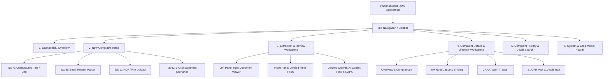

# Phase 1: Frontend Information Architecture & Component Design
## AI-Powered Customer Complaint Management System for Pharmaceutical Manufacturing

---

## 1. Technology Foundations & Design Standards

- **Core Framework:** React 18+ (Functional Components with React Hooks)
- **Language:** TypeScript for compile-time safety and type alignment with backend Pydantic models
- **Global State Management:** Redux Toolkit (`@reduxjs/toolkit` + `react-redux`)
- **Typography:** **Google Inter** (`font-family: 'Inter', sans-serif`) with weights 300, 400, 500, 600, 700
- **Styling Architecture:** Tailwind CSS with custom pharmaceutical theme tokens
- **Icons:** Lucide React (clean, medical-grade SVG line iconography)

---

## 2. Visual Theme & Clinical Design System

The visual design language is tailored specifically for enterprise pharmaceutical compliance—prioritizing clarity, legibility, and unmistakable visual risk signaling:

| Token Name | Hex Code | Purpose & Semantic Usage |
| :--- | :--- | :--- |
| `pharma-slate-900` | `#0f172a` | Primary header text, sidebar background, high-contrast structural borders |
| `pharma-slate-50` | `#f8fafc` | Application canvas background |
| `pharma-blue-600` | `#0284c7` | Clinical action primary buttons, active tabs, links |
| `pharma-blue-50` | `#f0f9ff` | Subtle highlighting for active panels and table selection |
| `pharma-emerald-600` | `#059669` | Minor Risk / Low Criticality / High Confidence ($\ge 85\%$) / Completed |
| `pharma-amber-500` | `#d97706` | Major Risk / Medium Criticality / Under Investigation / Warning |
| `pharma-rose-600` | `#e11d48` | Critical Risk (Class I) / Adverse Drug Reaction / Regulatory Alert |

### Typography Scale (Google Inter):
- **Display 1 (Page Headers):** `text-2xl font-bold tracking-tight text-slate-900`
- **Section Headers (Card Titles):** `text-lg font-semibold text-slate-800`
- **Body Regular:** `text-sm font-normal text-slate-600 leading-relaxed`
- **Data Table / Form Labels:** `text-xs font-semibold uppercase tracking-wider text-slate-500`
- **Badges & Tags:** `text-xs font-medium px-2.5 py-0.5 rounded-full`

---

## 3. Site Navigation & Information Hierarchy



---

## 4. Screen Architecture & Wireframe Specifications

### Screen 1: Dashboard (`/dashboard`)
- **Header:** Title, "Log New Complaint" quick action button, last refreshed timestamp.
- **Metric Deck (4 Grid Cards):**
  - `Open Complaints Count` (with trend indicator vs last week).
  - `Critical Class I Alert Count` (red border, alert icon).
  - `Average Cycle Time (Days)` (progress bar against 30-day target).
  - `Pending CAPAs Count` (overdue items highlighted in amber).
- **Analytics Deck:**
  - *Monthly Intake Chart:* Stacked bar breakdown (API vs FDF).
  - *Risk Category Donut:* Critical, Major, Minor proportions.
- **Recent Complaints Table:** Latest 5 complaints with quick "Open" links.

---

### Screen 2: Multi-Modal Complaint Intake (`/intake`)
- **Intake Mode Selector:** 4 modern tab triggers.
- **Form Area:**
  - Dedicated textarea / inputs with character counts.
  - Document dropzone with drag-and-drop animations.
  - 4 quick-launch buttons for pre-loaded pharma test scenarios.
- **Trigger Button:** Large glowing button: `⚡ Analyze with AI Copilot (Groq Gemma-2)`.

---

### Screen 3: Extraction & Review Screen (`/intake/review`)
- **Sticky Status Bar:**
  - Completeness Meter: Animated radial or bar gauge (0–100%).
  - AI Confidence Badge: e.g. `96% Confidence (gemma2-9b-it)`.
  - Action Controls: `Reset Form`, `Save as Draft`, `Confirm & Register CMP-ID`.
- **Two-Column Split Layout:**
  - **Left (Source):** Read-only viewer with search/zoom for the original customer email/PDF.
  - **Right (Form):** Grouped accordion/cards for Complainant Info, Product & Lot Details, Defect Classification, and Patient Safety Triage.
  - Each input field features an AI Confidence indicator pip (Green, Yellow, Red) and allows direct keyboard editing.

---

### Screen 4: AI Copilot Drawer (Side Slide-over or Tab)
- Real-time intelligent feedback as the user reviews:
  - **Risk Assessment Card:** Calculated RPN ($S \times O \times D$), Criticality tier badge, and clinical safety rationale.
  - **Regulatory Escalation Flag:** Prominent alert box if an Adverse Drug Reaction is detected.
  - **Duplicate / Batch Alerts:** Chips indicating if this batch or customer has prior complaints.
  - **Suggested Follow-up Questions:** Copyable prompts to send back to the complainant if required fields are missing.

---

### Screen 5: Complaint Details & Lifecycle Workspace (`/complaints/:id`)
- **Header:** `CMP-YYYY-XXXXX`, Product Title, Current Lifecycle Badge (`Logged`, `Under Investigation`, `CAPA Pending`, `Closed`), and Lifecycle Step Bar.
- **Interactive Tabs:**
  1. *Overview:* Complete metadata, original document download, complainant profile.
  2. *Investigation (6M):* Interactive Ishikawa diagram; editable 5-Whys causal tree; retain sample lab testing checklist.
  3. *CAPA Management:* Action item grid (Immediate Containment, Corrective, Preventive), assigned owners, due date countdowns, status toggles.
  4. *Audit Trail:* Chronological Part 11 compliant table with diff view (Old Value vs New Value).

---

### Screen 6: Complaint History & Advanced Query (`/history`)
- **Search & Multi-Filter Bar:** Instant debounce search + dropdowns for Status, Criticality, Product Category, Batch Number, and Date Range.
- **Data Table:** Sortable columns, pagination (10/25/50 per page), status badges, batch tag pill, action buttons (`View Details`, `Download Summary`).
- **Export Toolbar:** "Export CSV" and "Print Quality Report".

---

### Screen 7: System Settings & Model Health (`/settings`)
- Displays live connectivity status, Groq model latency tests, database connection pool statistics, and active system configuration.

---

## 5. Reusable Component Inventory

The frontend is built from a modular library of reusable atomic components:

```
frontend/src/components/
├── common/
│   ├── Button.tsx               # Primary, Secondary, Danger, Ghost buttons with loading spinners
│   ├── Input.tsx                # Text input with label, error message, and AI confidence indicator
│   ├── Select.tsx               # Accessible dropdown selector
│   ├── Textarea.tsx             # Auto-resizing textarea
│   ├── Badge.tsx                # Status and criticality pills
│   ├── Modal.tsx                # Accessible overlay modal dialog
│   └── Card.tsx                 # Standard clinical container card
├── feedback/
│   ├── CompletenessGauge.tsx    # Radial / linear progress bar with color thresholds
│   ├── ConfidenceBadge.tsx      # Field-level AI confidence badge (High/Med/Low)
│   ├── AlertBanner.tsx          # Regulatory alert callout (Critical/Warning/Info)
│   └── Toast.tsx                # Ephemeral notification toast
├── data-display/
│   ├── MetricCard.tsx           # Dashboard KPI stat card with icon and delta
│   ├── DataTable.tsx            # Generic sortable, paginated data grid
│   ├── AuditTrailTimeline.tsx   # Chronological 21 CFR Part 11 visual change ledger
│   └── IshikawaView.tsx         # 6M Fishbone cause-and-effect visualization
├── forms/
│   ├── FileUploadZone.tsx       # Drag-and-drop document uploader with progress
│   ├── FiveWhysEditor.tsx       # Interactive 5-step causal root-cause editor
│   └── RiskMatrixSelector.tsx   # Interactive S x O x D matrix evaluator
└── layout/
    ├── Navbar.tsx               # Global top navigation bar
    ├── Sidebar.tsx              # Collapsible navigation drawer
    └── PageContainer.tsx        # Standard max-w-7xl responsive wrapper
```

---

## 6. Redux Toolkit State Architecture

The application state is managed cleanly using Redux Toolkit slices:

```typescript
// frontend/src/store/index.ts
import { configureStore } from '@reduxjs/toolkit';
import complaintsReducer from './slices/complaintsSlice';
import aiCopilotReducer from './slices/aiCopilotSlice';
import uiReducer from './slices/uiSlice';

export const store = configureStore({
  reducer: {
    complaints: complaintsReducer,
    aiCopilot: aiCopilotReducer,
    ui: uiReducer,
  },
});

export type RootState = ReturnType<typeof store.getState>;
export type AppDispatch = typeof store.dispatch;
```

### 6.1 `aiCopilotSlice.ts`
Manages AI pipeline execution, streaming status, and structured extraction results:

```typescript
export interface AICopilotState {
  isAnalyzing: boolean;
  activeStep: 'idle' | 'normalizing' | 'extracting' | 'validating' | 'scoring_risk' | 'complete';
  analysisResult: CompositeAIResponse | null;
  error: string | null;
}
```
- **Async Thunks:**
  - `analyzeTextAsync(text: string, source_type: string)`
  - `analyzeDocumentAsync(formData: FormData)`
  - `recalculateRiskAsync(scoringPayload: RiskScoringPayload)`

### 6.2 `complaintsSlice.ts`
Manages complaint repository records, current active complaint view, and filters:

```typescript
export interface ComplaintsState {
  items: ComplaintSummaryItem[];
  total: number;
  page: number;
  limit: number;
  selectedComplaint: ComplaintDetail | null;
  filters: {
    search: string;
    status: string;
    criticality: string;
    product_category: string;
    date_range: [string | null, string | null];
  };
  metrics: DashboardMetrics | null;
  isLoading: boolean;
  isSaving: boolean;
  error: string | null;
}
```
- **Async Thunks:**
  - `fetchDashboardMetricsAsync()`
  - `fetchComplaintsAsync(params)`
  - `fetchComplaintByIdAsync(id: string)`
  - `createComplaintAsync(payload: CreateComplaintPayload)`
  - `updateComplaintAsync({ id, payload })`
  - `updateComplaintStatusAsync({ id, new_status, change_reason })`

### 6.3 `uiSlice.ts`
Manages global UI behaviors, notifications, and sidebar visibility:

```typescript
export interface UIState {
  sidebarOpen: boolean;
  activeIntakeTab: 'text' | 'email' | 'document' | 'demo';
  notifications: Array<{
    id: string;
    type: 'success' | 'error' | 'warning' | 'info';
    message: string;
  }>;
}
```
