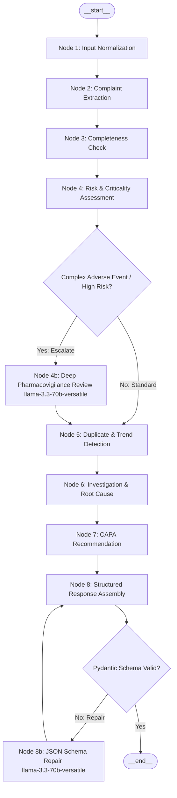

# Phase 1: LangGraph AI Agent Architecture & Node Specification
## AI-Powered Customer Complaint Management System for Pharmaceutical Manufacturing

---

## 1. Architectural Philosophy & Graph Overview

The AI engine of the Complaint Management System is constructed using **LangGraph** (the industry standard for stateful, cyclic, and deterministic multi-step LLM workflows) and deployed over **Groq's ultra-low-latency LPU inference infrastructure**.

### Model Hierarchy:
- **Primary Workhorse:** `gemma2-9b-it` (utilized for ultra-fast text normalization, initial entity extraction, and regulatory completeness validation).
- **Contextual Escalation / Complex Reasoning:** `llama-3.3-70b-versatile` (engaged for nuanced pharmacovigilance adverse event triage, complex 6M root-cause synthesis, or as an automated JSON repair fallback if `gemma2-9b-it` produces malformed structures).

---

## 2. LangGraph State Machine Architecture



---

## 3. LangGraph State Definition (`ComplaintGraphState`)

The state shared across all nodes is strictly typed using Python `TypedDict` and `Pydantic`:

```python
from typing import TypedDict, Optional, List, Dict, Any

class ComplaintGraphState(TypedDict):
    # Raw Inputs
    raw_input_text: str
    source_type: str  # "email", "text", "document"
    uploaded_file_name: Optional[str]
    
    # Normalized Pre-processing
    cleaned_text: str
    metadata_headers: Dict[str, Any]
    
    # Node 2: Extraction Output
    extracted_data: Optional[Dict[str, Any]]
    extraction_confidence: float
    
    # Node 3: Completeness Output
    completeness_score: float
    is_ready_for_logging: bool
    missing_mandatory: List[str]
    missing_recommended: List[str]
    follow_up_questions: List[str]
    
    # Node 4: Risk Assessment Output
    severity: str
    criticality: str
    risk_level: str
    rpn_score: int
    clinical_rationale: str
    regulatory_alert: bool
    
    # Node 5: Duplicate Detection Output
    is_duplicate: bool
    duplicate_probability: float
    matched_complaints: List[Dict[str, Any]]
    batch_clustering_detected: bool
    clustering_summary: Optional[str]
    
    # Node 6: Investigation & Root Cause Output
    ishikawa_category: str
    probable_root_causes: List[str]
    five_whys: List[Dict[str, Any]]
    recommended_testing: List[str]
    
    # Node 7: CAPA Output
    immediate_containment: List[str]
    corrective_actions: List[Dict[str, Any]]
    preventive_actions: List[Dict[str, Any]]
    
    # Node 8: Final Output & Telemetry
    final_structured_response: Optional[Dict[str, Any]]
    errors: List[str]
    retry_count: int
    model_trail: List[str]
    total_execution_time_ms: int
```

---

## 4. Deep-Dive Node Specifications

---

### Node 1: `normalize_input_node`
- **Responsibility:** Cleanses, standardizes, and strips noise from inbound user text, pasted email threads, or OCR results.
- **Input:** `raw_input_text`, `source_type`.
- **Processing Logic:**
  1. Detects and parses standard email headers (`From:`, `Sent:`, `To:`, `Subject:`) into `metadata_headers`.
  2. Strips email disclaimers, confidential notice footers, automated auto-replies, and HTML tags.
  3. Replaces non-printable Unicode characters with normalized ASCII.
- **Output:** `cleaned_text`, `metadata_headers`.
- **Failure Behavior:** If input is empty or $< 10$ characters, records error in `errors` and routes to graceful error exit.

---

### Node 2: `extract_complaint_node`
- **Responsibility:** Performs zero-shot entity extraction into the pharmaceutical schema using **Groq `gemma2-9b-it`**.
- **Input:** `cleaned_text`, `metadata_headers`.
- **Target Entities:**
  - Customer Name, Organization, Email, Country
  - Product Name, Product Code/SKU, Manufacturing Type (`API` vs `FDF`)
  - Dosage Form, Strength, Batch/Lot Number, Expiry Date, Site
  - Complaint Category, Defect Description, Affected Quantity, Sample Availability
  - Patient Involvement, Patient Impact, Adverse Drug Reaction
- **Prompt Strategy:** System prompt instructs the model as a Senior Pharmaceutical Regulatory Documentation Specialist. Enforces extraction of explicit facts only, setting unknown values to `null`.
- **Output:** `extracted_data`, `extraction_confidence`.
- **Failure Behavior:** If `gemma2-9b-it` output fails basic JSON parsing, it runs a single fallback retry invoking `llama-3.3-70b-versatile` with `json_object` response format.

---

### Node 3: `completeness_check_node`
- **Responsibility:** Deterministically and semantically evaluates whether the extracted complaint satisfies statutory FDA 21 CFR § 211.198 and ICH Q10 record requirements.
- **Input:** `extracted_data`.
- **Evaluation Criteria:**
  - *Mandatory Fields (Weight: 20% each):* `product_name`, `batch_lot_number`, `reported_defect`, `customer_contact`.
  - *Recommended Fields (Weight: 5% each):* `expiration_date`, `dosage_form`, `affected_quantity`, `sample_available`.
- **Calculation:**
  $$\text{Completeness Score} = \sum (\text{Present Fields} \times \text{Weight})$$
- **Clarification Generation:** Generates professional, polite follow-up questions for any missing fields to assist the customer care team.
- **Output:** `completeness_score`, `is_ready_for_logging`, `missing_mandatory`, `missing_recommended`, `follow_up_questions`.
- **Failure Behavior:** Deterministic fallback rule-checker computes score if LLM generation times out.

---

### Node 4: `risk_assessment_node`
- **Responsibility:** Implements Quality Risk Management (ICH Q9) to compute defect severity, clinical patient impact, and Risk Priority Number (RPN).
- **Input:** `extracted_data`, `cleaned_text`.
- **Evaluation Logic:**
  - Evaluates clinical risk: Is the defect cosmetic (carton scratch), functional (blister unsealed, slow dissolution), or critical (sterile particulate, toxic impurity, wrong active ingredient)?
  - Calculates $S$ (Severity 1–5), $O$ (Occurrence 1–5), $D$ (Detectability 1–5), $\text{RPN} = S \times O \times D$.
  - Assigns Criticality: `Critical` (Class I), `Major` (Class II), `Minor` (Class III).
  - Evaluates Pharmacovigilance criteria: Sets `regulatory_alert: True` if adverse event or hospitalization is reported.
- **Output:** `severity`, `criticality`, `risk_level`, `rpn_score`, `clinical_rationale`, `regulatory_alert`.
- **Escalation Branch:** If `patient_impact` is `Severe Illness` or `Life-Threatening`, state transitions to `deep_pharmacovigilance_node` (`llama-3.3-70b-versatile`) for secondary clinical verification.

---

### Node 5: `duplicate_detection_node`
- **Responsibility:** Identifies recurring complaints and systemic batch manufacturing deviations.
- **Input:** `extracted_data.product_batch.batch_lot_number`, `extracted_data.defect.reported_defect`.
- **Processing Logic:**
  1. Queries PostgreSQL database for all historical complaints sharing the identical `batch_lot_number`.
  2. Queries historical records for the same `product_name` within the preceding 180 days.
  3. Computes lexical and semantic overlap between defect narratives.
  4. If $\ge 3$ complaints exist for the same batch, sets `batch_clustering_detected: True` and writes an alert summary.
- **Output:** `is_duplicate`, `duplicate_probability`, `matched_complaints`, `batch_clustering_detected`, `clustering_summary`.
- **Failure Behavior:** If database query fails, gracefully defaults to `matched_complaints: []` without halting the pipeline.

---

### Node 6: `investigation_recommendation_node`
- **Responsibility:** Formulates preliminary manufacturing hypotheses to jumpstart the Quality Control Unit's investigation.
- **Input:** `extracted_data`, `risk_assessment`.
- **Processing Logic:**
  - Classifies the most probable root cause under the **6M Ishikawa Framework** (`Man`, `Machine`, `Method`, `Material`, `Measurement`, `Environment`).
  - Formulates a 5-step **5-Whys Analysis** drill-down tailored to pharmaceutical unit operations (e.g. tablet compression, sterile filling, packaging knurling).
  - Specifies standard analytical QC tests to confirm root cause (e.g., Karl Fischer moisture, Dissolution USP <711>, HPLC Impurity Profiling USP <621>).
- **Output:** `ishikawa_category`, `probable_root_causes`, `five_whys`, `recommended_testing`.
- **Failure Behavior:** Generates standardized unit-operation default investigation protocol if model generation fails.

---

### Node 7: `capa_recommendation_node`
- **Responsibility:** Generates compliant Corrective and Preventive Action plans aligned with ICH Q10 continual improvement principles.
- **Input:** `extracted_data`, `investigation_recommendations`.
- **Processing Logic:**
  - **Immediate Containment:** Batch quarantine in SAP/ERP, warehouse hold, customer sample retrieval.
  - **Corrective Actions:** Immediate repair, tooling replacement, calibration, batch re-inspection.
  - **Preventive Actions:** Engineering controls (poka-yoke interlocks), SOP revision, operator requalification, vendor supplier audit.
  - Generates concrete effectiveness verification protocols.
- **Output:** `immediate_containment`, `corrective_actions`, `preventive_actions`.
- **Failure Behavior:** Supplies standard containment checklist.

---

### Node 8: `synthesize_output_node`
- **Responsibility:** Validates the compiled state against the master `CompositeAIResponseSchema` Pydantic model and compiles execution telemetry.
- **Input:** Full `ComplaintGraphState`.
- **Processing Logic:**
  1. Validates schema using Pydantic v2 `model_validate()`.
  2. Measures total pipeline latency (ms).
  3. Appends model audit trail (`['gemma2-9b-it', 'llama-3.3-70b-versatile']`).
- **Output:** `final_structured_response`.
- **Routing:** If validation succeeds -> `__end__`. If validation fails and retry count $< 2$ -> routes to `repair_schema_node` (`llama-3.3-70b-versatile`) to format strictly.

---

## 5. LangGraph Construction Code Blueprint

```python
"""
LangGraph Workflow Assembly for Pharma Complaint Management.
"""

import time
from typing import Dict, Any
from langgraph.graph import StateGraph, END, START
from langchain_groq import ChatGroq

# Initialize LLMs via Groq
primary_llm = ChatGroq(model_name="gemma2-9b-it", temperature=0.1)
reasoning_llm = ChatGroq(model_name="llama-3.3-70b-versatile", temperature=0.2)

def create_complaint_graph():
    workflow = StateGraph(ComplaintGraphState)

    # 1. Register Nodes
    workflow.add_node("normalize_input", normalize_input_node)
    workflow.add_node("extract_complaint", extract_complaint_node)
    workflow.add_node("completeness_check", completeness_check_node)
    workflow.add_node("risk_assessment", risk_assessment_node)
    workflow.add_node("deep_pharmacovigilance", deep_pharmacovigilance_node)
    workflow.add_node("duplicate_detection", duplicate_detection_node)
    workflow.add_node("investigation_recommendations", investigation_recommendations_node)
    workflow.add_node("capa_recommendations", capa_recommendations_node)
    workflow.add_node("synthesize_output", synthesize_output_node)
    workflow.add_node("repair_schema", repair_schema_node)

    # 2. Build Core Pipeline Edges
    workflow.add_edge(START, "normalize_input")
    workflow.add_edge("normalize_input", "extract_complaint")
    workflow.add_edge("extract_complaint", "completeness_check")
    workflow.add_edge("completeness_check", "risk_assessment")

    # 3. Conditional Branch for Critical Clinical Escalation
    def check_clinical_severity(state: ComplaintGraphState) -> str:
        if state.get("criticality") == "Critical" or state.get("regulatory_alert"):
            return "deep_pharmacovigilance"
        return "duplicate_detection"

    workflow.add_conditional_edges(
        "risk_assessment",
        check_clinical_severity,
        {
            "deep_pharmacovigilance": "deep_pharmacovigilance",
            "duplicate_detection": "duplicate_detection"
        }
    )
    workflow.add_edge("deep_pharmacovigilance", "duplicate_detection")

    # 4. Continuation Edges
    workflow.add_edge("duplicate_detection", "investigation_recommendations")
    workflow.add_edge("investigation_recommendations", "capa_recommendations")
    workflow.add_edge("capa_recommendations", "synthesize_output")

    # 5. Conditional Branch for Schema Validation / Self-Healing
    def validate_final_schema(state: ComplaintGraphState) -> str:
        if state.get("final_structured_response") is not None:
            return END
        if state.get("retry_count", 0) < 2:
            return "repair_schema"
        return END

    workflow.add_conditional_edges(
        "synthesize_output",
        validate_final_schema,
        {
            END: END,
            "repair_schema": "repair_schema"
        }
    )
    workflow.add_edge("repair_schema", "synthesize_output")

    return workflow.compile()
```
