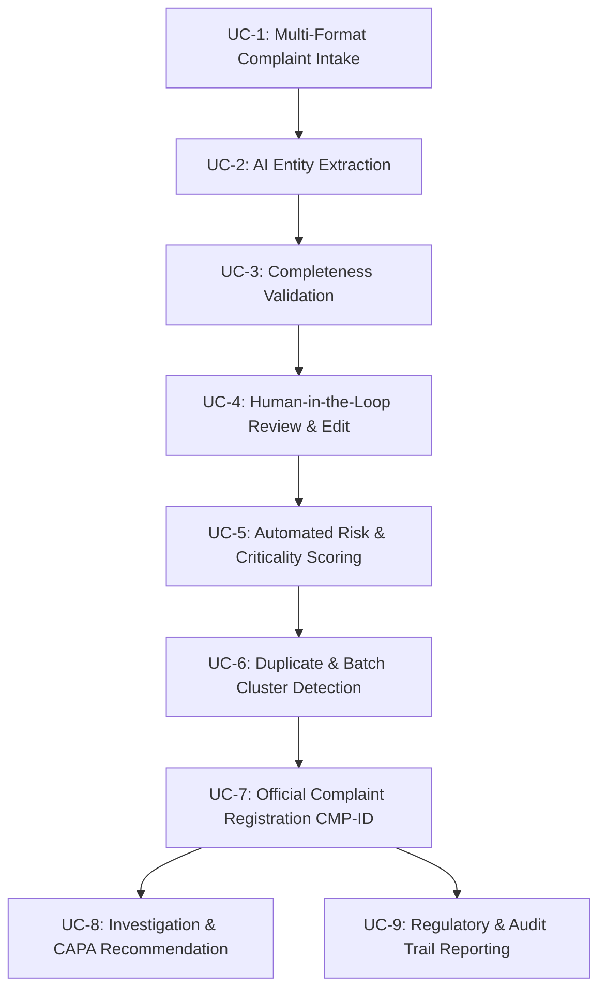

# Phase 1: Product Requirements Document (PRD)
## AI-Powered Customer Complaint Management System for Pharmaceutical Manufacturing

---

## 1. Executive Product Overview

In the pharmaceutical industry, managing customer complaints is not merely a customer service function—it is a critical, legally mandated component of the **Pharmaceutical Quality System (PQS)**. Regulations established by the **US FDA (21 CFR Part 211.198)**, **EU GMP Chapter 8**, and **ICH Q10 Guidelines** require pharmaceutical manufacturers to maintain formal written procedures for receiving, logging, evaluating, investigating, and trending complaints. Failures in complaint handling (e.g., failure to detect batch contamination, delayed adverse event escalation, incomplete investigations, or missing CAPA links) are among the most frequent citations in FDA Warning Letters and EU GMP inspection deficiencies.

The **AI-Powered Customer Complaint Management System** is a next-generation, audit-ready Quality Intelligence platform designed to transform unstructured, multi-channel complaint inputs (free-form customer emails, call center transcripts, quality defect reports, and scanned laboratory/hospital PDF forms) into structured, risk-prioritized, and regulatory-compliant complaint records.

Powered by a **LangGraph** orchestration workflow utilizing **Groq's ultra-fast inference** (`gemma2-9b-it` as the primary extraction and completeness agent, with `llama-3.3-70b-versatile` for deep risk analysis and JSON synthesis), the system automates:
1. Multi-modal complaint intake and entity extraction.
2. Regulatory completeness validation against FDA/ICH reporting standards.
3. Automated Quality Risk Management (QRM) scoring (Severity, Criticality, Patient Safety Impact).
4. Historical duplicate and batch-defect cluster detection.
5. Evidence-based Root Cause Hypotheses (6M / Ishikawa framework).
6. Actionable Corrective and Preventive Action (CAPA) recommendations.
7. End-to-end Human-in-the-Loop (HITL) verification and 21 CFR Part 11 compliant audit trails.

---

## 2. Pharmaceutical Domain & Manufacturing Context

The platform is designed to handle complaints across the two primary manufacturing sectors in the pharmaceutical value chain:

### 2.1 Active Pharmaceutical Ingredient (API) Manufacturing
- **Nature of Operations:** Chemical synthesis, fermentation, crystallization, purification, and bulk powder handling.
- **Common Complaint Types:**
  - **Physical Characteristics:** Out-of-specification particle size distribution (PSD), inconsistent bulk density, discoloration, foreign particulate contamination (e.g., gasket shavings, rust specks), abnormal moisture content / caking.
  - **Chemical & Analytical:** Out-of-spec assay/potency, elevated related substances / process impurities, residual solvents (ICH Q3C), elemental impurities (ICH Q3D).
  - **Packaging & Integrity:** Damaged drum liners, compromised tamper-evident seals, label discrepancies (batch number mismatch, incorrect storage condition labels).
- **Target Customers:** Finished Dosage Form (FDF) drug product manufacturers, contract formulation partners.

### 2.2 Finished Dosage Form (FDF) Manufacturing
- **Nature of Operations:** Granulation, compression, encapsulation, liquid filling, sterile filtration, lyophilization, secondary blistering, and packaging.
- **Common Complaint Types:**
  - **Solid Orals (Tablets / Capsules):** Capped, chipped, or cracked tablets; incorrect tablet imprint/marking; dissolution failure; mottling; missing tablets in blister pockets; empty or leaking capsule shells.
  - **Sterile Parenterals (Vials / Ampoules / Syringes):** Visible sub-visible particulate matter (glass flakes, fibers), container closure integrity (CCI) leaks, crimp defects, sterility failure, cloudiness/turbidity.
  - **Liquid Orals & Suspensions:** Phase separation, precipitate formation, syringe/dropper graduation misprint, microbial contamination.
  - **Packaging & Labeling:** Misprinted lot numbers, missing expiration dates, barcode scanning failures, incorrect patient leaflets (PIL).
  - **Clinical & Pharmacovigilance Events:** Lack of therapeutic effect, unexpected adverse drug reactions (ADRs), accidental dosing confusion caused by ambiguous packaging.
- **Target Customers:** Hospitals, clinical pharmacies, wholesale distributors, retail pharmacies, and direct healthcare providers (HCPs).

---

## 3. Regulatory Standards & Compliance Foundations

The system architecture and business logic directly reflect the mandates of international pharmaceutical quality regulations:

| Regulatory Standard | Key Mandate | Implementation in Complaint Management System |
| :--- | :--- | :--- |
| **US FDA 21 CFR § 211.198** | Written procedures for complaint handling; review by Quality Control Unit; determination of whether complaint represents an OOS/defect; mandatory investigation for batch failures. | Quality Unit workflow gates; automated prompt to determine if complaint constitutes a potential OOS; structured investigation logging. |
| **ICH Q10 (PQS)** | Establishes Complaint Management, Deviation Handling, and CAPA as core subsystems for continual product improvement and management review. | Integrated pipeline connecting complaint intake -> investigation -> root cause -> CAPA -> effectiveness monitoring. |
| **EU GMP Chapter 8** | Risk-based approach to quality defects; rapid defect triage; mandatory escalation for potentially defective batches already in distribution; notification of competent authorities. | Automated Criticality determination (Critical, Major, Minor); immediate notification triggers for critical recalls/quarantines. |
| **ICH Q9 (QRM)** | Quality Risk Management: systematic risk assessment based on Severity, Probability of Occurrence, and Detectability (Risk Priority Number - RPN). | Automated Risk Assessment engine evaluating Patient Impact, Severity Level, and calculated RPN score. |
| **FDA 21 CFR Part 11 & EU Annex 11** | Electronic records, audit trail integrity, timestamping, reason for modification, user accountability, system security. | Immutable audit log table recording every field change (`old_value`, `new_value`, `user_id`, `timestamp`, `change_reason`). |

---

## 4. User Personas & Stakeholders

### Persona 1: Quality Assurance Specialist (Complaint Handler)
- **Role:** Primary frontline intake operator responsible for logging, triaging, and performing initial reviews of inbound complaints.
- **Pain Points:** Overwhelmed by unstructured emails, missing lot numbers, incomplete descriptions, manual re-typing into legacy QMS, difficulty spotting repeat complaints from the same customer or batch.
- **System Value:** AI auto-extracts fields from emails/PDFs in under 3 seconds; immediate completeness check highlights missing critical details before logging; AI duplicate detector spots batch recurrence.

### Persona 2: Quality Operations / QA Manager
- **Role:** Quality Unit supervisor responsible for reviewing assessments, approving risk classifications, assigning investigations, and signing off on CAPA plans.
- **Pain Points:** Delays in identifying high-risk or critical patient-impact events; inconsistent risk categorization across team members; lack of centralized visibility into open complaints.
- **System Value:** Instant AI Copilot risk scoring (RPN, Criticality); automated flagging of potential 15-day regulatory reporting events; unified dashboard showing open investigations, aging complaints, and CAPA bottlenecks.

### Persona 3: Qualified Person (QP) / Regulatory Affairs Associate
- **Role:** Senior regulatory and release authority responsible for evaluating whether a quality defect requires notification to health authorities (FDA Form 3500A / MedWatch, EU competent authorities) or product recall.
- **Pain Points:** Lack of immediate historical batch context during a crisis; slow root-cause synthesis across distributed manufacturing sites.
- **System Value:** Evidence-based 6M root cause suggestions; instant duplicate and batch trend clustering; audit-ready PDF/JSON reporting with full data lineage.

---

## 5. Primary Use Cases

- **UC-1: Complaint Intake from Multiple Sources:** Input complaints via free-form text, pasted email headers and threads, uploaded customer letter PDFs, or scanned inspection reports.
- **UC-2: AI-Assisted Extraction:** Extract customer info, product details, batch/lot number, manufacturing site, defect narrative, and medical symptoms without manual data entry.
- **UC-3: Regulatory Completeness Verification:** Check if mandatory regulatory fields (product name, lot number, defect description, reporter contact) are present; compute a 0–100% completeness score and suggest specific follow-up questions for the customer if data is missing.
- **UC-4: Human-in-the-Loop Verification:** Allow the QA Specialist to verify, adjust, or supplement AI-extracted fields with side-by-side comparison against the original source text.
- **UC-5: Automated Quality Risk & Criticality Assessment:** Calculate Patient Impact (None, Minor, Severe, Life-Threatening), Severity (Minor, Major, Critical), Detectability, and RPN. Flag potential adverse events for regulatory escalation.
- **UC-6: Duplicate & Recurrence Detection:** Query the complaint repository to identify identical or similar complaints on the same batch or across historical lots.
- **UC-7: Complaint Logging & State Management:** Assign official tracking ID (`CMP-YYYY-XXXXX`), enforce immutable creation timestamps, and register complaint under active status.
- **UC-8: Root Cause & CAPA Synthesis:** Generate structured 5-Whys root cause hypotheses and CAPA action items according to 6M categories (Man, Machine, Method, Material, Measurement, Environment).
- **UC-9: Audit Trail & Historical Search:** Provide search, filtering by product/batch/risk, and full traceability of all edits with mandatory change rationales.

---

## 6. Functional Requirements (FR)

### Module 1: Intake & Normalization
- **FR-1.1:** System shall accept unstructured plain text inputs up to 10,000 characters.
- **FR-1.2:** System shall accept pasted email text containing email headers (From, To, Date, Subject, Body).
- **FR-1.3:** System shall accept document uploads (.txt, .pdf, .png/jpeg scanned images) and extract text cleanly.
- **FR-1.4:** System shall provide pre-configured realistic synthetic test cases (API defect, FDF blister packaging defect, pediatric dosing discrepancy, sterile parenteral particulate).

### Module 2: AI Entity Extraction & Normalization
- **FR-2.1:** System shall extract at least 25 pharmaceutical domain attributes, including:
  - Customer Name, Organization, Role, Contact Email/Phone, Country
  - Product Name, Product Code/SKU, Product Category (API vs FDF)
  - Dosage Form (e.g., Tablet, Capsule, Sterile Vial, Suspension, Bulk Powder)
  - Strength / Concentration (e.g., 500 mg, 10 mg/mL)
  - Batch / Lot Number
  - Expiration Date & Manufacturing Date (if mentioned)
  - Manufacturing Site / Facility
  - Complaint Category (Packaging, Physical, Chemical, Microbial, Labeling, Clinical/Efficacy, Counterfeit)
  - Specific Reported Defect Description
  - Patient Involvement (Yes/No/Unknown)
  - Patient Impact / Adverse Event description (if applicable)
  - Quantity of affected units / packs
- **FR-2.2:** System shall return an extraction confidence score (0.0 to 1.0) for both individual fields and overall extraction.

### Module 3: Completeness Evaluation
- **FR-3.1:** System shall evaluate the extracted payload against mandatory regulatory fields:
  - *Mandatory:* Product Name, Batch/Lot Number, Reported Defect Description, Complainant Contact.
  - *Recommended:* Expiration Date, Sample Availability, Quantity Affected, Storage Condition, Patient Impact.
- **FR-3.2:** System shall compute an overall **Completeness Score (0–100%)**.
- **FR-3.3:** If score is < 80% or mandatory fields are missing, system shall generate structured **Follow-up Clarification Questions** for the QA handler to send to the customer.

### Module 4: Risk Assessment & Criticality Classification
- **FR-4.1:** System shall classify complaints into regulatory risk tiers:
  - **Critical (Class I equivalent):** Potential for serious adverse health consequence or death (e.g., foreign particulate in sterile injectable, severe superpotency, mix-up of active drug, glass fragments).
  - **Major (Class II equivalent):** Potential to cause temporary or medically reversible adverse health consequences, or serious defect not presenting acute safety hazard (e.g., failed dissolution, seal leak leading to degradation, subpotency, missing tamper seal).
  - **Minor (Class III equivalent):** Quality defect not likely to cause adverse health consequences (e.g., cosmetic blister foil wrinkle, outer carton scuff, slight variation in imprint ink darkness).
- **FR-4.2:** System shall compute a **Risk Priority Number (RPN)**:
  $$\text{RPN} = \text{Severity (1–5)} \times \text{Probability of Occurrence (1–5)} \times \text{Detectability (1–5)}$$
- **FR-4.3:** System shall automatically trigger an **Expedited Regulatory Notification Alert** if a medical adverse event is detected, referencing the required reporting window (e.g., 15-day alert report for FDA).

### Module 5: Duplicate & Trend Detection
- **FR-5.1:** System shall compute semantic and rule-based similarity against existing database records using Batch Number, Product Name, and Defect Embeddings/Keywords.
- **FR-5.2:** System shall flag potential duplicate complaints with a matching confidence percentage and direct links to prior complaint IDs (`CMP-XXXX`).
- **FR-5.3:** System shall detect **Batch Clustering Signals** (e.g., $\ge 3$ complaints against the same batch within 30 days) to alert the QA Manager of a systemic manufacturing deviation.

### Module 6: Human-in-the-Loop Review & Editable Form
- **FR-6.1:** System shall present the AI-extracted fields in an editable web form with visual indicators of AI confidence (Green: High $\ge 0.85$, Yellow: Moderate $0.60–0.84$, Red: Low $<0.60$ or Missing).
- **FR-6.2:** System shall allow the QA operator to manually edit, accept, or override any field.
- **FR-6.3:** System shall require the user to confirm the Risk Assessment before final registration.

### Module 7: Complaint Logging & Database Persistence
- **FR-7.1:** System shall assign an immutable unique identifier formatted as `CMP-YYYY-XXXXX` upon submission.
- **FR-7.2:** System shall persist all fields to the PostgreSQL database with proper foreign key relationships, timestamps, and active status (`Logged`).
- **FR-7.3:** System shall save the raw input text, attachments, and the exact AI inference response for audit traceability.

### Module 8: Investigation & CAPA Management
- **FR-8.1:** System shall generate an automated Investigation Brief containing:
  - Problem Statement (standardized regulatory format).
  - Probable Root Causes categorized by the **6M Ishikawa Framework** (Man, Machine, Method, Material, Measurement, Milieu/Environment).
  - Recommended Root Cause Analysis methodology (e.g., 5-Whys, Retain Sample Testing, Batch Manufacturing Record / BMR Review).
- **FR-8.2:** System shall generate actionable CAPA recommendations:
  - **Immediate Containment:** Batch quarantine, customer sample return protocol.
  - **Corrective Actions:** Equipment recalibration, SOP update, retraining.
  - **Preventive Actions:** Poka-yoke tooling modification, raw material vendor audit.

### Module 9: Audit Trail & 21 CFR Part 11 Compliance
- **FR-9.1:** System shall maintain an automated, immutable audit log of all create, update, and status-change operations.
- **FR-9.2:** Any edit to an existing complaint record must capture:
  - User ID / Author
  - Timestamp (UTC ISO 8601)
  - Field Name
  - Old Value
  - New Value
  - Mandatory Reason for Change

---

## 7. Non-Functional Requirements (NFR)

### 7.1 Performance & Latency
- **NFR-1.1:** AI Extraction and Completeness evaluation via Groq `gemma2-9b-it` shall complete in $< 3.0$ seconds for standard complaints ($< 2,000$ tokens).
- **NFR-1.2:** Database queries for complaint search, filtering, and history pagination shall execute in $< 200$ ms.
- **NFR-1.3:** Frontend initial load time shall be $< 1.5$ seconds on standard broadband connections.

### 7.2 Availability & Resilience
- **NFR-2.1:** Backend FastAPI service shall implement graceful error handling with standard HTTP status codes (200, 201, 400, 404, 422, 500, 503).
- **NFR-2.2:** In the event of Groq API rate limits or transient outages, the system shall implement an exponential backoff retry mechanism (3 attempts) before falling back to a structured local error state.

### 7.3 Security & Data Protection
- **NFR-3.1:** All API keys (`GROQ_API_KEY`, database credentials, JWT secrets) must be loaded strictly from backend environment variables (`.env`). No secrets may be bundled into frontend client code.
- **NFR-3.2:** All user inputs and uploaded files shall undergo server-side validation and sanitization to prevent SQL injection, cross-site scripting (XSS), and path traversal.
- **NFR-3.3:** Patient personally identifiable information (PII) must be handled securely with sensitive health data flags.

### 7.4 Usability & UI/UX Standards
- **NFR-4.1:** Clean, modern, pharmaceutical-grade user interface designed with the **Google Inter** font family.
- **NFR-4.2:** Standardized clinical color palette: Deep Slate (#0f172a) for structural clarity, Clinical Teal (#0284c7) for primary actions, Emerald (#10b981) for Minor/Low risk, Amber (#f59e0b) for Major/Medium risk, and Crimson/Rose (#e11d48) for Critical/High risk.
- **NFR-4.3:** Fully responsive layout with minimum supported resolution of 1280x720.

---

## 8. Complaint Lifecycle State Machine

The complaint follows a strict, unidirectional pharmaceutical lifecycle governed by quality gates:

```mermaid
stateDiagram-v2
    [*] --> Draft: User begins Intake
    Draft --> Extracted: AI Extraction & Completeness Complete
    Extracted --> Reviewed: QA Specialist Verifies/Edits Form
    Reviewed --> Logged: Complaint Officially Saved (CMP-ID Issued)
    Logged --> UnderInvestigation: Assigned to Quality Investigator
    UnderInvestigation --> CAPAPending: Root Cause Identified; CAPA Required
    UnderInvestigation --> ClosureReview: No Defect Found / Non-Justified
    CAPAPending --> ClosureReview: CAPA Implemented & Verified
    ClosureReview --> Closed: QP / QA Manager Approves Closure
    Closed --> Reopened: New Evidence / Recurring Batch Trend Detected
    Reopened --> UnderInvestigation
```

### State Definitions:
1. **Draft:** Initial unstructured text/document loaded; extraction in progress.
2. **Extracted:** AI processing complete; awaiting QA specialist review.
3. **Reviewed:** QA specialist has confirmed extracted entities and risk assessment.
4. **Logged:** Officially registered in the PQS with unique `CMP-YYYY-XXXXX` tracking ID; Quality Unit notified.
5. **Under Investigation:** Technical investigation underway (Retain sample visual inspection, analytical testing, BMR review).
6. **CAPA Pending:** Root cause established; Corrective and Preventive Actions formulated and assigned to action owners.
7. **Closure Review:** Formal complaint report prepared; Quality Assurance and QP review all investigation findings.
8. **Closed:** Final approval signed; customer closeout letter generated; record archived.
9. **Reopened:** Triggered only if new clinical information surfaces or identical defects emerge indicating ineffective CAPA.

---

## 9. AI Workflow Architecture

The AI agent architecture is implemented using **LangGraph** to guarantee predictable, auditable, and modular execution.

```mermaid
graph LR
    A[Raw Input] --> B[Node 1: Input Normalization]
    B --> C[Node 2: Entity Extraction]
    C --> D[Node 3: Completeness Validation]
    D --> E[Node 4: Risk & Criticality Scoring]
    E --> F[Node 5: Duplicate & Trend Detection]
    F --> G[Node 6: Investigation & CAPA Generator]
    G --> H[Node 7: Schema Validation & Response Synthesis]
    H --> I[Structured AI Response Payload]
```

- **Node 1 (Input Normalization):** Cleans extraneous whitespace, extracts email metadata (sender, date, headers), strips boilerplate signatures.
- **Node 2 (Entity Extraction - Groq `gemma2-9b-it`):** Extracts core entities into structured Pydantic format with field-level confidence ratings.
- **Node 3 (Completeness Validation):** Evaluates mandatory vs optional fields; computes completeness percentage; crafts tailored follow-up queries.
- **Node 4 (Risk & Criticality Scoring):** Evaluates medical hazard, patient involvement, defect severity, calculates RPN, and assigns Critical/Major/Minor classification. (Can escalate to `llama-3.3-70b-versatile` if complex pharmacovigilance reasoning is required).
- **Node 5 (Duplicate & Trend Detection):** Executes semantic similarity matching against active complaint database; detects batch clustering.
- **Node 6 (Investigation & CAPA Recommendations):** Synthesizes 6M Ishikawa hypotheses and immediate containment protocols.
- **Node 7 (Response Synthesis):** Validates the composite output against the master Pydantic response schema, logging latency and token telemetry.

---

## 10. Error Handling & Fallback Protocols

1. **LLM Output Formatting Failure:** If Groq output fails Pydantic schema validation, the system automatically runs a schema-repair prompt or falls back to a deterministic regex/rule extractor to guarantee zero crash rate.
2. **Groq API Rate Limiting / 429:** Handled with exponential backoff and jitter (initial delay 500ms, max 3 retries). If exhausted, the system returns a descriptive `503 Service Unavailable` with instructions to retry or switch model.
3. **Database Transaction Failure:** All complaint saves and status changes are wrapped in atomic SQLAlchemy database transactions (`db.commit()`, `db.rollback()`). If an error occurs, the database state remains uncorrupted.
4. **Invalid User Inputs:** FastAPI request validation automatically returns detailed `422 Unprocessable Entity` responses specifying the exact field and error condition.

---

## 11. 21 CFR Part 11 & Auditability Requirements

In compliance with FDA 21 CFR Part 11 (Electronic Records; Electronic Signatures) and EU GMP Annex 11:
- **Immutable Log Storage:** Audit trail records cannot be edited or deleted through the API or user interface.
- **Complete Lineage:** Every update generates an entry containing:
  - Timestamp (UTC ISO format)
  - User Identifier / Session
  - Action Type (CREATE, UPDATE, STATUS_CHANGE, DELETE)
  - Target Entity ID
  - Changed Field Name
  - Previous Value
  - Updated Value
  - Mandatory Change Rationale (e.g., "Corrected batch number following receipt of customer photograph of carton").
- **AI Accountability:** The exact model version (`gemma2-9b-it`), prompt version, raw model completion, and confidence scores are persisted in the `ai_assessments` table for every automated run.
