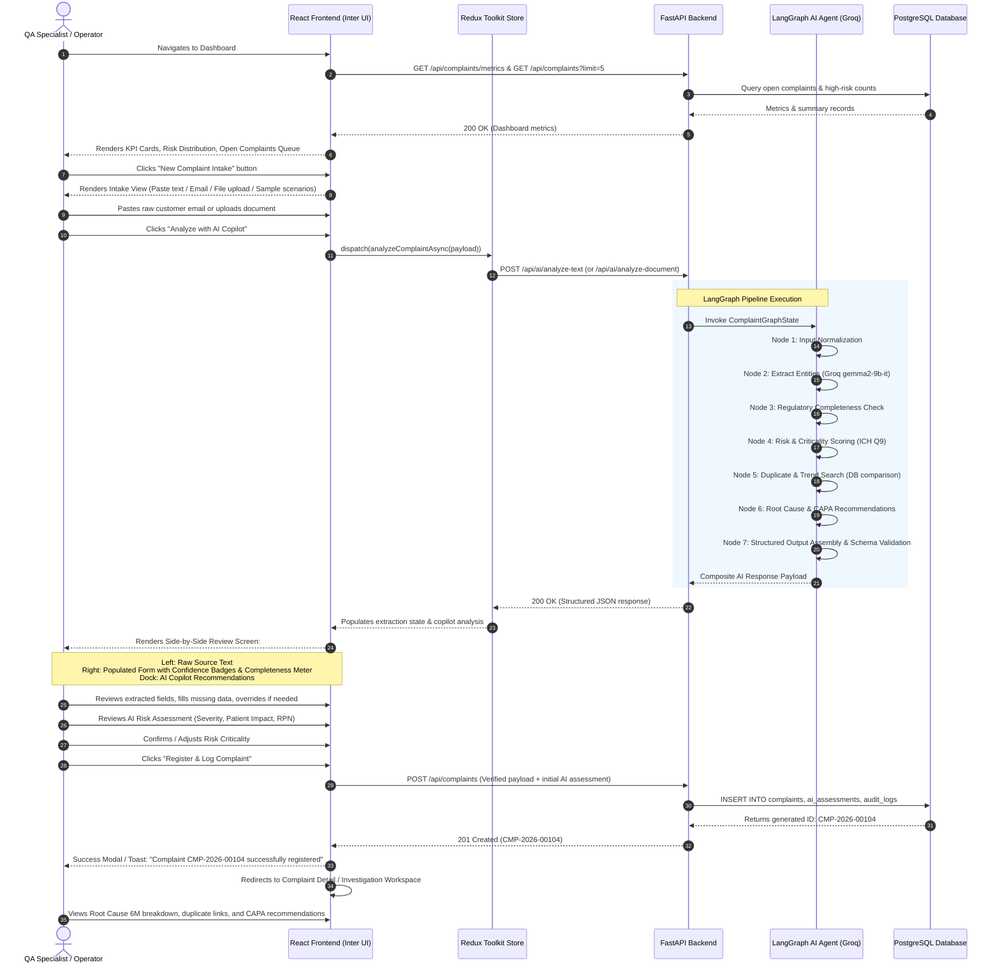

# Phase 1: User Flow & Interaction Design
## AI-Powered Customer Complaint Management System for Pharmaceutical Manufacturing

---

## 1. Reference Video Access & Limitation Statement

> [!IMPORTANT]
> **Regulatory / Technical Compliance Statement on Video Access:**
> The provided assignment reference link:
> `https://drive.google.com/file/d/1av2lzDPx8YMSzTrIz7w51HTRWBz3_5Nj/view?usp=sharing` (titled `AIVOA- complaints module demo.mp4`) was inspected programmatically. The URL resolves to an interactive Google Drive video player requiring authenticated streaming protocols that cannot be headlessly viewed or extracted within this execution environment.
>
> In accordance with the prompt's explicit directive:
> *"If the video cannot be accessed, clearly document the limitation and create the workflow using the assignment description without pretending that you viewed the video."*
>
> This document details the complete end-to-end user flow, screen sequence, user actions, input fields, AI Copilot interactions, and state transitions derived directly from the assignment specification, pharmaceutical QMS standards (**US FDA 21 CFR 211.198**, **ICH Q10**, **EU GMP Chapter 8**), and best practices in Quality Engineering.

---

## 2. Global End-to-End User Flow

The following diagram details the primary operational journey from initial complaint arrival to technical investigation and resolution:

---

## 3. Screen-by-Screen Interaction Specifications

### Screen 1: Quality Operations Dashboard (`/`)

#### Purpose:
Central command center for Quality Assurance personnel to monitor complaint volumes, aging investigations, critical risk events, and recent intakes.

#### Visual Hierarchy & Layout:
- **Top Navigation Bar:** System logo (*PharmaGuard AI*), environment indicator (`PRODUCTION READY / GROQ ONLINE`), global quick-search bar, "New Complaint" primary action button, user profile/role pill (`QA Specialist`).
- **Row 1: KPI Metric Cards (4 Cards):**
  1. *Total Active Complaints:* Count with month-over-month trend.
  2. *Critical / Class I Alerts:* Count rendered with red pulsing badge.
  3. *Average Investigation Cycle Time:* Days (Target: $< 30$ days per FDA guidance).
  4. *Pending CAPA Actions:* Open vs overdue count.
- **Row 2: Quality Intelligence Charts:**
  - *Left Chart (60% width):* Monthly Complaint Influx by Product & Category (API vs FDF stacked bar chart).
  - *Right Chart (40% width):* Risk Matrix Distribution (Critical, Major, Minor donut chart).
- **Row 3: Active Action Queue:**
  - Tabbed table: `Awaiting QA Review`, `Under Investigation`, `Pending CAPA Approval`, `All Complaints`.
  - Columns: Complaint ID, Received Date, Product, Batch, Reported Defect, Criticality Badge, Status, Assigned Owner, Actions (`View Details`).

---

### Screen 2: Complaint Intake & Ingestion (`/intake`)

#### Purpose:
Ingest unstructured customer communications across diverse physical and digital channels.

#### User Actions & Inputs:
1. **Intake Mode Selector (Tabs):**
   - **Tab A: Raw Text / Customer Call:** Large multiline textarea (placeholder: *"Paste raw complaint transcript, phone log, or customer email..."*). Character counter and clear button.
   - **Tab B: Email Header Parser:** Dedicated inputs for `Email Sender`, `Subject Line`, `Received Date`, and `Email Body`.
   - **Tab C: Document / PDF Upload:** Drag-and-drop file zone supporting `.pdf`, `.txt`, `.png`, `.jpg`. Shows file name, size, upload progress, and clear button.
   - **Tab D: Pre-loaded Demo Scenarios (One-Click Testing):**
     - *Scenario 1 (API Defect):* Paracetamol API Bulk Powder Black Particulate Contamination.
     - *Scenario 2 (FDF Packaging):* Amoxicillin 500mg Blister Foil Pinhole Leak & Softened Tablets.
     - *Scenario 3 (Clinical / Adverse Event):* Metformin XR 500mg Pediatric Accidental Dosing / Confusing Bottle Label.
     - *Scenario 4 (Sterile Parenteral):* Ciprofloxacin Infusion Vial Glass Flake Particulate (Critical).
2. **Action Controls:**
   - **"Analyze with AI Copilot" Button (Primary):** Triggers backend LangGraph extraction pipeline with animated loading state and step-by-step progress indicator (*"Normalizing text... Extracting entities... Assessing patient safety... Checking duplicates..."*).
   - **"Clear All" Button:** Resets intake forms.

---

### Screen 3: Human-in-the-Loop Extraction & Review Screen (`/intake/review`)

#### Purpose:
Provides transparent, explainable validation where the QA specialist reviews and approves AI extractions before committing them to the official regulatory register.

#### Layout: Dual-Pane Split Screen

#### Left Pane (40% width): Raw Source Document Viewer
- Shows original raw text or parsed PDF text with syntax/entity highlighting.
- QA user can copy or cross-reference numbers and statements directly.

#### Right Pane (60% width): Structured Form & Quality Gauges
- **Header Gauge Bar:**
  - **Completeness Score Progress Bar:** Colored dynamically (Green $\ge 80\%$, Yellow $50–79\%$, Red $< 50\%$).
  - **Overall Extraction Confidence Badge:** (e.g., `94% AI Confidence`).
  - **Missing Required Fields Banner:** If any mandatory fields are missing, alerts the user (e.g., *"Missing: Batch/Lot Number. Customer follow-up recommended."*).
- **Section 1: Complainant Information:**
  - Customer Name `[Input]`
  - Organization / Hospital / Pharmacy `[Input]`
  - Complainant Role `[Dropdown: Patient, Pharmacist, Physician, Distributor, Wholesaler]`
  - Contact Email & Phone `[Input]`
  - Country / Jurisdiction `[Input]`
- **Section 2: Product & Batch Identification:**
  - Product Name `[Input with autocomplete]`
  - Product Code / SKU `[Input]`
  - Manufacturing Type `[Radio: API (Active Ingredient) | FDF (Finished Dosage Form)]`
  - Dosage Form `[Dropdown: Tablet, Capsule, Liquid Oral, Sterile Parenteral, Bulk Powder, Cream/Ointment]`
  - Strength / Concentration `[Input]`
  - **Batch / Lot Number** `[Input with highlight badge]`
  - Expiration Date & Manufacturing Date `[Date Pickers]`
  - Manufacturing Facility / Site `[Input]`
- **Section 3: Defect Description & Nature:**
  - Complaint Category `[Dropdown: Packaging, Physical Defect, Chemical/Assay, Microbial, Labeling/Artwork, Lack of Efficacy, Adverse Event, Counterfeit Suspect]`
  - Defect Narrative / Summary `[Textarea]`
  - Affected Quantity `[Input with unit selector]`
  - Sample Availability `[Toggle: Sample Returned by Customer? Yes / No / Awaiting]`
- **Section 4: Patient Impact & Pharmacovigilance Triage:**
  - Patient Involved? `[Toggle: Yes / No / Unknown]`
  - Adverse Drug Reaction (ADR) Reported? `[Toggle: Yes / No]`
  - Medical Event Description `[Textarea]`

---

### Screen 4: AI Copilot Quality Risk Assessment (`/intake/risk-assessment`)

#### Purpose:
Empowers the Quality Assurance Specialist with an objective, algorithmic Quality Risk Management (ICH Q9) evaluation.

#### Copilot Panel Components:
1. **Criticality Classification:**
   - Visual Badge: `CRITICAL (Class I)` | `MAJOR (Class II)` | `MINOR (Class III)`.
   - Clear explanatory explanation generated by the LLM explaining why the rating was assigned based on patient safety and defect characteristics.
2. **ICH Q9 Risk Scoring Matrix:**
   - **Severity Score (1 to 5):**
     - $1 = \text{Negligible (Cosmetic carton scuff)}$
     - $2 = \text{Minor (Non-critical packaging defect)}$
     - $3 = \text{Moderate (Temporary reversible discomfort, off-spec tablet weight)}$
     - $4 = \text{Major (Potential clinical impairment, failed dissolution)}$
     - $5 = \text{Critical (Life-threatening, non-sterility, toxic impurity, pediatric overdose)}$
   - **Occurrence / Probability Score (1 to 5):** Estimated based on historical complaint frequency for that product/batch.
   - **Detectability Score (1 to 5):** Ease with which the customer or release testing detects the defect ($1 = \text{Immediate visual detection}$, $5 = \text{Undetectable without HPLC analysis}$).
   - **Calculated RPN:** $\text{RPN} = S \times O \times D$ (Range: 1 to 125).
3. **Expedited Regulatory Reporting Alert:**
   - If Severity is Critical or ADR is present, a high-priority warning card appears:
     > *"⚠️ Regulatory Reporting Alert: Potential Serious Adverse Event / Class I Defect detected. Prepare FDA MedWatch Form 3500A / EU Competent Authority Rapid Alert notification within 15 calendar days."*
4. **Duplicate & Batch Recurrence Signals:**
   - Real-time matching against database:
     - *"Found 2 existing complaints for Batch #BX-2026-091 within the last 45 days."*
     - Clickable chips to preview prior complaints (`CMP-2026-00088`, `CMP-2026-00092`).
5. **Confirmation & Sign-Off:**
   - QA Specialist can accept the AI assessment or click "Override Assessment" (which prompts for a mandatory justification note).
   - "Register Complaint" button commits record to database.

---

### Screen 5: Complaint Details & Lifecycle Workspace (`/complaints/:id`)

#### Purpose:
Full lifecycle tracking, technical investigation, CAPA management, and regulatory audit trail.

#### Tabbed Workspace Sections:
- **Tab 1: Overview & Metadata:** Full complaint profile, intake source text, complainant details, product specs, current lifecycle badge (`Logged`, `Under Investigation`, `CAPA Pending`, `Closed`).
- **Tab 2: Technical Investigation:**
  - **Problem Statement (Automated standard phrasing):** *"On [Date], customer reported [Defect] in Batch [Batch#] manufactured at [Site]..."*
  - **Ishikawa 6M Cause-and-Effect Breakdown:**
    - *Man:* Operator technique during blister sealing.
    - *Machine:* Heat sealing bar temperature fluctuation on Packaging Line 3.
    - *Method:* Inadequate frequency of leak testing in packaging SOP-PKG-042.
    - *Material:* Foil vendor pinhole specification tolerance.
    - *Measurement:* Visual inspection sampling plan AQL level.
    - *Milieu (Environment):* Packaging room relative humidity spike.
  - **5-Whys Root Cause Drill-down:** Interactive 5-step causal tree.
  - **Investigation Status:** Open, In Progress, Awaiting Lab Testing, Completed.
- **Tab 3: CAPA Management:**
  - Immediate Containment Action (e.g., *"Quarantine remaining warehouse inventory of Batch BX-2026-091"*).
  - Corrective Actions (e.g., *"Replace temperature thermocouple on Sealing Station 2"*).
  - Preventive Actions (e.g., *"Implement automated vision inspection system for blister micro-pinholes"*).
  - Implementation Owner & Target Due Date.
  - Effectiveness Verification Plan (e.g., *"Inspect next 5 consecutive production batches for zero seal failure"*).
- **Tab 4: 21 CFR Part 11 Audit Trail:**
  - Chronological timeline table: Date/Time (UTC), User, Action, Field Changed, Previous Value, New Value, Change Reason.

---

### Screen 6: Complaint History & Advanced Query (`/history`)

#### Purpose:
Audit-ready search and quality trend reporting.

#### Controls & Capabilities:
- **Search Bar:** Real-time search across Complaint ID, Customer Name, Batch Number, Product Name, and Defect keywords.
- **Filters:**
  - Product Type (All, API, FDF).
  - Status (Draft, Logged, Under Investigation, CAPA Pending, Closed).
  - Criticality (Critical, Major, Minor).
  - Date Range (Last 7 Days, Last 30 Days, Last 90 Days, Custom Range).
- **Export Actions:** "Export to CSV" and "Generate QMS Audit Summary PDF".

---

### Screen 7: System Settings & Model Health (`/settings`)

#### Purpose:
Operational visibility into the AI and backend infrastructure.

#### Details Displayed:
- **Groq API Status:** Connectivity status (Online / Latency: 320ms).
- **Primary Model:** `gemma2-9b-it` (Active).
- **Contextual Model:** `llama-3.3-70b-versatile` (Standby / Fallback enabled).
- **Database Status:** PostgreSQL connection pool health and record count.
- **Compliance Mode:** 21 CFR Part 11 strict audit mode enabled.
